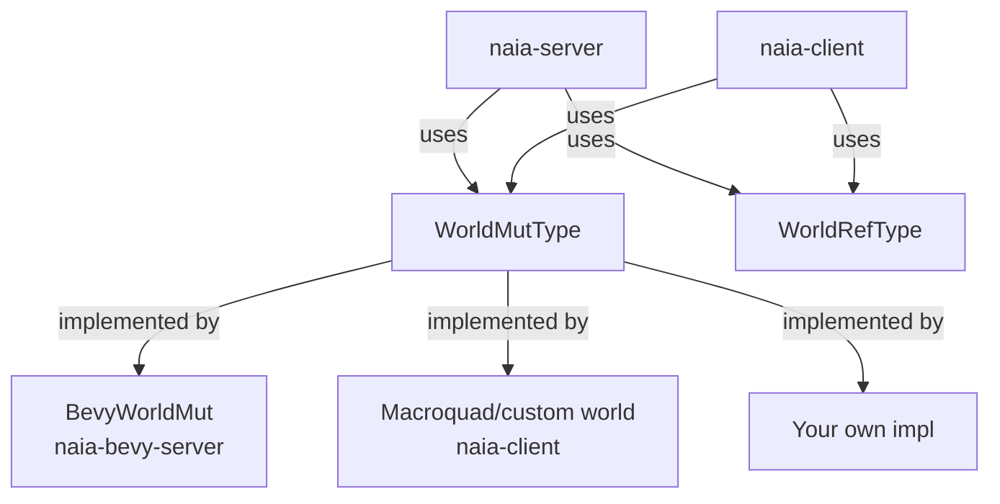

# Core API Overview

If you are using Bevy, you do not need this chapter — the Bevy adapter handles
everything. This chapter is for macroquad users, custom engine users, or anyone
who wants to use naia's ECS-agnostic core API directly.

> **Bevy users:** See [Your First Server](../getting-started/first-server.md)
> and [Your First Client](../getting-started/first-client.md) for the Bevy-first
> walkthroughs.

---

## The five-step loop

naia's core API requires you to run five methods in order every frame. This is
the loop that the Bevy plugin automates for you:

```rust
use naia_server::{transport::webrtc, Server, ServerConfig};
use my_game_shared::protocol;

fn main() {
    let mut server: Server<u32> = Server::new(ServerConfig::default(), protocol());
    let socket = webrtc::Socket::new(&webrtc::ServerAddrs::default(), server.socket_config());
    server.listen(socket);

    let mut world = MyWorld::new();
    let room_key = server.create_room().key();

    loop {
        // 1. Read UDP/WebRTC datagrams from the OS into the receive queue.
        server.receive_all_packets();

        // 2. Decode packets into EntityEvent objects and apply client mutations.
        server.process_all_packets();

        // 3. Drain connection, spawn, update, and message events.
        let events = server.take_world_events(&mut world);
        for connect_event in events.read::<ConnectEvent>() {
            let user_key = connect_event.user_key;
            let entity = world.alloc_entity();
            server
                .spawn_entity(&mut world)
                .insert_component(Position::new(0.0, 0.0));
            server.room_mut(&room_key).add_user(&user_key);
            server.room_mut(&room_key).add_entity(&entity);
        }

        // 4. Advance the tick clock. Mutate replicated components here.
        for tick_event in server.take_tick_events() {
            for entity in world.entities() {
                if let Some(mut pos) = server.component_mut::<Position>(&mut world, &entity) {
                    *pos.x += 0.1;
                }
            }
        }

        // 5. Serialise field diffs and messages; flush to the network.
        //    MUST be the last step — any mutations after this are deferred
        //    to the next frame.
        server.send_all_packets(&mut world);

        std::thread::sleep(std::time::Duration::from_millis(1));
    }
}
```

The client loop is identical in structure but processes packets from a single
server connection rather than from many users.

---

## WorldMutType and WorldRefType

naia's core crates are generic over the entity type `E` (any `Copy + Eq + Hash +
Send + Sync` value) and over a world wrapper trait:

- **`WorldMutType<E>`** — mutable world access: spawn entity, insert/remove
  components, despawn entity.
- **`WorldRefType<E>`** — immutable world access: read component values.

You implement these traits for your game world struct, or use the provided
implementations for Bevy (`BevyWorldMut`) and macroquad. The full trait
definitions and a minimal implementation template live in `naia-shared`.



---

## Available adapters

| Adapter | Crate | Notes |
|---------|-------|-------|
| Bevy | `naia-bevy-server`, `naia-bevy-client` | Full server + client support; recommended |
| macroquad | `naia-client` + `mquad` feature | Client via core API |
| Custom | Implement `WorldMutType` + `WorldRefType` | See [Writing Your Own Adapter](custom.md) |

See also:
- [Macroquad](macroquad.md) — macroquad client setup.
- [Writing Your Own Adapter](custom.md) — implement the adapter traits for a custom engine.
