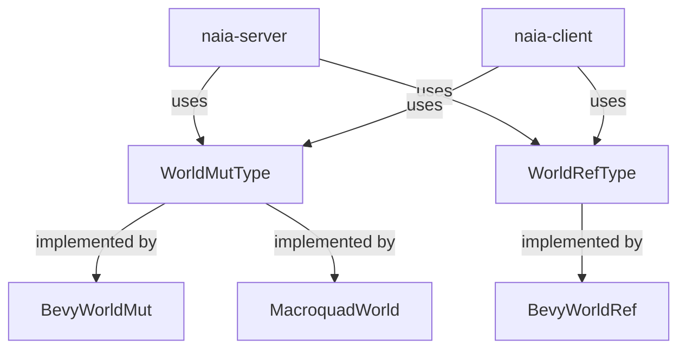

# Overview & Adapter Contract

naia's core crates (`naia-server`, `naia-client`) are ECS-agnostic. They work
with any entity type that satisfies `Copy + Eq + Hash + Send + Sync`. The
adapter layer bridges naia's generic API to a specific game framework.

---

## Adapter trait hierarchy

An adapter implements:

- **`WorldMutType<E>`** — mutable world access: spawn entity, insert/remove
  components, despawn entity.
- **`WorldRefType<E>`** — immutable world access: read component values.

---

## Why ECS-agnostic?

Most game networking libraries lock you into a specific ECS framework. naia's
ECS-agnostic core means:

- The same naia version works with Bevy, macroquad, or a custom game loop.
- Tests run against `transport_local` without any framework overhead.
- Community adapters for other frameworks (Fyrox, Macroquest, custom engines)
  can be built without modifying naia core.

---

## Available adapters

| Adapter | Crate | Notes |
|---------|-------|-------|
| Bevy | `naia-bevy-server`, `naia-bevy-client` | Full server + client support |
| macroquad | `naia-macroquad-client` | Client only |
| Custom | Implement `WorldMutType` + `WorldRefType` | See [Writing Your Own Adapter](custom.md) |
