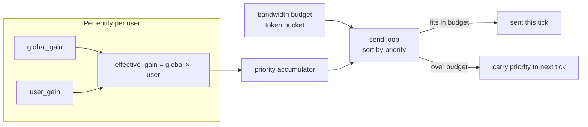

# Priority-Weighted Bandwidth

By default every replicated entity competes equally for outbound bandwidth. The
priority accumulator system lets you tilt that competition: entities with a
higher gain accumulate priority faster and therefore tend to be replicated more
frequently within the same bandwidth budget.

---

## Priority accumulator diagram



---

## Setting entity priority

```rust
// On the server, after spawning an entity:

// 2× the replication frequency of a normal entity.
server.global_entity_priority_mut(entity).set_gain(2.0);

// ~25% of normal frequency — useful for background/ambient entities.
server.global_entity_priority_mut(entity).set_gain(0.25);

// Pause replication for this entity entirely (gain = 0.0).
server.global_entity_priority_mut(entity).set_gain(0.0);

// Per-user priority: replicate faster to the owner than to spectators.
server.user_entity_priority_mut(&owner_key, entity).set_gain(3.0);
server.user_entity_priority_mut(&spectator_key, entity).set_gain(0.5);
```

The effective gain for a given user is:
`global_gain × user_gain` (both default to `1.0`).

The send loop sorts all dirty entity bundles by their accumulated priority each
tick and drains them against the per-connection bandwidth budget. Entities that
do not fit in the current tick's budget carry their accumulated priority into
the next tick — so temporarily crowded budgets don't starve low-priority entities
forever.

> **Tip:** A gain of `0.0` prevents the entity from ever being selected by the send loop —
> effectively pausing replication for that entity without removing it from scope.
> Use this for entities that are temporarily invisible (behind a wall, in a fog of
> war zone) to free up bandwidth for visible entities.

---

## Bandwidth budget

`BandwidthConfig` sets the per-connection outbound target:

```rust
use naia_bevy_shared::BandwidthConfig;

// In ServerConfig / ClientConfig:
config.connection.bandwidth = BandwidthConfig {
    target_bytes_per_sec: 32_000, // 256 kbps — tighter budget for mobile
};
```

The default is 64 000 bytes/sec (512 kbps). The send loop accumulates a token
bucket of `target_bytes_per_sec × dt` each tick and drains it against the
priority-sorted dirty entity list.

---

## Connection diagnostics

`Server::connection_stats(&user_key)` and `Client::connection_stats()` return a
`ConnectionStats` snapshot computed on demand from internal ring buffers:

```rust
// Server side:
if let Some(stats) = server.connection_stats(&user_key) {
    println!("RTT p50={:.0}ms p99={:.0}ms loss={:.1}% out={:.1}kbps in={:.1}kbps",
        stats.rtt_p50_ms, stats.rtt_p99_ms,
        stats.packet_loss_pct * 100.0,
        stats.kbps_sent, stats.kbps_recv);
}
```

| Field | Description |
|-------|-------------|
| `rtt_ms` | Round-trip time EWMA in milliseconds |
| `rtt_p50_ms` | RTT 50th-percentile from the last 32 samples |
| `rtt_p99_ms` | RTT 99th-percentile from the last 32 samples |
| `jitter_ms` | EWMA of half the absolute RTT deviation |
| `packet_loss_pct` | Fraction of sent packets unacknowledged in the last 64-packet window |
| `kbps_sent` | Rolling-average outgoing bandwidth in kilobits per second |
| `kbps_recv` | Rolling-average incoming bandwidth in kilobits per second |

> **Note:** Call `connection_stats` at most once per frame per connection — it performs a
> small sort for the percentile computation.

For deeper bandwidth analysis, see [Bandwidth Budget Analysis](../perf/bandwidth.md).
