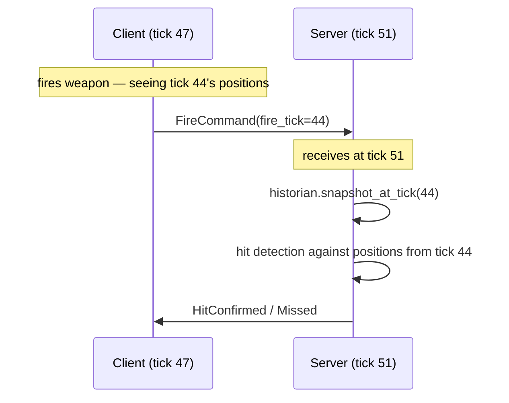

# Lag Compensation with Historian

In a server-authoritative game each client renders the world a little in the
past — typically `RTT/2 + interpolation_buffer` milliseconds behind the server.
When a client fires a weapon it sends the *client* tick at which the shot was
taken. By the time that packet arrives the server has advanced by another
`RTT/2` ticks. If the server tests the shot against the *current* world state,
the target has moved and the shot misses even though it was visually accurate
on the client.

The solution is **rewinding the server world** to the tick the client was
seeing, performing hit detection there, and then fast-forwarding back. naia's
`Historian` is the rolling per-tick snapshot buffer that makes rewinding
possible. This is a naia-exclusive feature — no other Rust game networking
library ships a built-in historian primitive.

---

## Historian snapshot timeline



---

## Enabling the Historian

```rust
// server startup — retain up to 64 ticks of history
// 64 ticks ≈ 3.2 s at 20 Hz, ≈ 1.1 s at 60 Hz
server.enable_historian(64);
```

The `Historian` is disabled by default. Call `enable_historian` once at startup
before the first tick runs.

---

## Recording snapshots

```rust
// Inside your per-tick update, after game-state mutation,
// before server.send_all_packets():
server.record_historian_tick(&world, current_tick);
```

`record_historian_tick` clones every replicated component on every replicated
entity and stores the result keyed by `(Tick, GlobalEntity, ComponentKind)`.
Old snapshots are automatically evicted once they exceed `max_ticks` age.

> **Warning:** Record **after** mutation so the snapshot reflects the authoritative state for
> that tick. Recording before mutation captures the previous tick's state and
> will cause off-by-one errors in hit detection.

---

## Looking up a snapshot

```rust
fn handle_fire(server: &Server<E>, fire_tick: Tick) {
    let Some(historian) = server.historian() else { return };
    let Some(world_at_fire) = historian.snapshot_at_tick(fire_tick) else {
        // Tick has been evicted — reject or use closest available
        return;
    };

    // world_at_fire: &HashMap<GlobalEntity, HashMap<ComponentKind, Box<dyn Replicate>>>
    for (entity, components) in world_at_fire {
        if let Some(pos_box) = components.get(&ComponentKind::of::<Position>()) {
            let pos = pos_box.downcast_ref::<Position>().unwrap();
            // perform sphere/AABB hit test against `pos` ...
        }
    }
}
```

You can also query by elapsed time instead of by tick:

```rust
// Snapshot from ~150 ms ago, given 50 ms ticks
let snap = historian.snapshot_at_time_ago_ms(150, current_tick, 50.0);
```

`snapshot_at_time_ago_ms` converts the time offset to ticks, finds the closest
snapshot, and falls back to the oldest retained snapshot rather than returning
`None` when the offset is large.

---

## Component filtering

By default the Historian clones **every** replicated component on every entity
each tick. On a busy server this can be significant.

If your hit detection only needs `Position` and `Health`, use
`enable_historian_filtered` to limit snapshotting to those kinds:

```rust
server.enable_historian_filtered(
    64,
    [ComponentKind::of::<Position>(), ComponentKind::of::<Health>()],
);
```

> **Tip:** Always use `enable_historian_filtered` in production. Snapshotting only the
> components you query for reduces per-tick allocation by the ratio of
> (filter_size / total_components_per_entity).

---

## Choosing `max_ticks`

`max_ticks` is the maximum lag (in ticks) you will compensate for:

| Tick rate | Target max lag | `max_ticks` |
|-----------|---------------|-------------|
| 20 Hz | 500 ms | 10 |
| 20 Hz | 3 s (generous buffer) | 64 |
| 60 Hz | 200 ms | 12 |
| 60 Hz | 500 ms | 30 |

Memory cost is roughly `max_ticks × entity_count × filter_size × avg_component_size`.

---

## Caveats

- The Historian does **not** back-fill past snapshots when an entity is spawned;
  the entity first appears in the snapshot taken on the tick *after* spawn.
- Despawned entities disappear from the snapshot on the tick they are removed.
- naia does **not** re-apply the rewound snapshot to the live world — you query
  the historical data and perform hit detection logic yourself.
- **Anti-cheat:** reject fire commands whose `fire_tick` is older than
  `max_ticks`. Without this check a malicious client can query arbitrarily old
  state.

> **Danger:** Always clamp the look-back window server-side. Accept `fire_tick` only if
> `server_tick - fire_tick <= max_ticks`. A client that sends a very old
> `fire_tick` can otherwise cause `snapshot_at_tick` to return stale data or
> trigger unnecessary computation.
