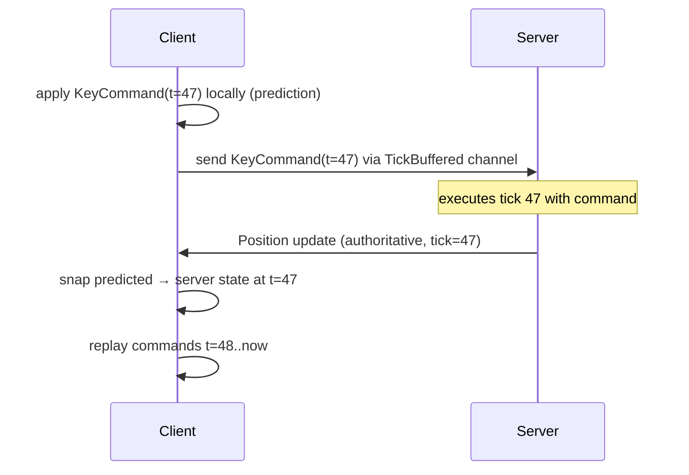

# Client-Side Prediction & Rollback

Client-side prediction hides network latency by letting the client apply inputs
immediately to a local copy of the player entity, without waiting for the
server's authoritative confirmation. When the server's correction arrives, the
client rolls back to the authoritative state and replays all buffered commands.

---

## Mental model

The server is authoritative. The client runs **ahead** of the server by
approximately half the round-trip time (RTT/2) so that commands the client
sends today arrive at the server in time for the server tick they belong to.

```
                client                     server
                  │                           │
 tick 47 ──────── │──── KeyCommand(t=47) ────▶│
 tick 48 ──────── │                           │
 tick 49 ──────── │◀─── Position(t=47) ───────│  (arrives ~RTT later)
                  │                           │
```

The client doesn't wait for the server's reply before moving the player — it
applies the input **immediately** to a local *predicted* copy of the entity.
When the authoritative correction arrives, the client:

1. Snaps the predicted state to the authoritative server state.
2. Re-simulates ("replays") every command issued after that correction tick.

---

## Prediction + rollback timeline



---

## The five building blocks

### 1. `TickBuffered` channel — stamped input delivery

```rust
// shared/src/channels.rs
protocol.add_channel::<PlayerCommandChannel>(ChannelSettings {
    mode: ChannelMode::TickBuffered(TickBufferSettings::default()),
    direction: ChannelDirection::ClientToServer,
});
```

`TickBuffered` attaches the **client tick number** to every message. The server
reads them with `receive_tick_buffer_messages(&server_tick)` — it only sees
commands whose stamp matches the current server tick, so input arrives at
exactly the right simulation step even under jitter.

### 2. `CommandHistory` — the replay buffer

```rust
use naia_bevy_client::CommandHistory;

// In your client resources:
pub command_history: CommandHistory<KeyCommand>,
```

`CommandHistory::new(128)` keeps the last 128 ticks of input. Choose a depth
of at least `ceil(max_expected_RTT_ticks × 2)`. Too shallow and corrections
outside the window cause a visible snap; too deep wastes memory.

### 3. `local_duplicate()` — creating the predicted entity

When the server assigns an entity to the local player, clone it into a local
*predicted* counterpart:

```rust
// In message_events, when EntityAssignment.assign == true:
let prediction_entity = commands.entity(confirmed_entity).local_duplicate();
global.owned_entity = Some(OwnedEntity {
    confirmed: confirmed_entity,
    predicted: prediction_entity,
});
```

`local_duplicate()` copies every `Replicate` component so the prediction starts
in sync with the server's last known state.

### 4. Per-tick loop — record → send → apply

```rust
pub fn tick_events(
    mut client: Client<Main>,
    mut global: ResMut<Global>,
    mut tick_reader: MessageReader<ClientTickEvent<Main>>,
    mut position_query: Query<&mut Position>,
) {
    let Some(predicted_entity) = global.owned_entity.as_ref()
        .map(|e| e.predicted) else { return; };
    let Some(command) = global.queued_command.take() else { return; };

    for event in tick_reader.read() {
        let client_tick = event.tick;

        // Guard: don't overflow the history window.
        if !global.command_history.can_insert(&client_tick) { continue; }

        // Record.
        global.command_history.insert(client_tick, command.clone());

        // Send (with tick stamp — arrives at server at the right tick).
        client.send_tick_buffer_message::<PlayerCommandChannel, KeyCommand>(
            &client_tick, &command,
        );

        // Apply locally (prediction — no server round-trip yet).
        if let Ok(mut position) = position_query.get_mut(predicted_entity) {
            shared_behavior::process_command(&command, &mut position);
        }
    }
}
```

### 5. Correction handler — rollback + re-simulate

```rust
pub fn update_component_events(
    mut global: ResMut<Global>,
    mut position_event_reader: MessageReader<UpdateComponentEvent<Main, Position>>,
    mut position_query: Query<&mut Position>,
) {
    let Some(owned) = &global.owned_entity else { return; };

    let mut latest_tick: Option<Tick> = None;
    for event in position_event_reader.read() {
        if event.entity == owned.confirmed {
            match latest_tick {
                Some(t) if sequence_greater_than(event.tick, t) => {}
                _ => latest_tick = Some(event.tick),
            }
        }
    }

    let Some(server_tick) = latest_tick else { return; };

    if let Ok([server_pos, mut client_pos]) =
        position_query.get_many_mut([owned.confirmed, owned.predicted])
    {
        // Step A: snap prediction to authoritative state.
        client_pos.mirror(&*server_pos);

        // Step B: re-simulate every command since that server tick.
        for (_tick, command) in global.command_history.replays(&server_tick) {
            shared_behavior::process_command(&command, &mut client_pos);
        }
    }
}
```

---

## Server side — reading stamped input

```rust
let mut messages = server.receive_tick_buffer_messages(&server_tick);
for (_user_key, command) in messages.read::<PlayerCommandChannel, KeyCommand>() {
    let Some(entity) = command.entity.get(&server) else { continue; };
    let Ok(mut position) = position_query.get_mut(entity) else { continue; };
    shared_behavior::process_command(&command, &mut position);
}
```

---

## Misprediction correction strategies

### Strategy A — Instant snap (simplest)

Snap the predicted entity directly to the server value, then replay. This is
correct but can produce a visible pop on high-latency links.

### Strategy B — Smooth error interpolation (production)

Record the pre-rollback render position, run the rollback, then blend the visual
position from old to new over 150–250 ms:

```rust
// Before rollback:
let pre_rollback_render_pos = render_position.current();

// Run the rollback:
predicted_pos.mirror(&*server_pos);
for (_tick, cmd) in global.command_history.replays(&server_tick) {
    shared_behavior::process_command(&cmd, &mut predicted_pos);
}

// Begin interpolating the visual error away:
let post_rollback_render_pos = interpolate_from_physics(&predicted_pos);
let error = pre_rollback_render_pos - post_rollback_render_pos;
render_position.begin_error_correction(error, CORRECTION_DURATION_MS);
```

Each frame, apply a decaying fraction of `error` on top of the physics position:

```rust
let alpha = elapsed_ms / CORRECTION_DURATION_MS;
let visual_pos = physics_pos + error * (1.0 - smooth_step(alpha));
```

---

## Tuning the prediction window

- **`CommandHistory::new(N)`** — keep at most N ticks of history. Set N ≥ 2 ×
  max RTT in ticks. At 20 Hz and 200 ms max RTT that's ≥ 8 ticks; 128 is a
  safe default.
- **`TickBufferSettings::default()`** — the tick buffer accepts commands within
  a small window around the current server tick. For high-jitter links, widen
  the window.
- **Tick rate** — lower tick rates (e.g. 20 Hz) increase the granularity of
  prediction mismatches. Higher rates reduce visible snap but increase CPU and
  bandwidth.

---

## Batching corrections

Multiple `UpdateComponentEvent`s can arrive in the same frame. Accumulate the
*earliest* correction tick across all component events, then run one rollback:

```rust
let mut rollback_tick: Option<Tick> = None;

for event in position_events.read() {
    if event.entity == owned.confirmed {
        rollback_tick = Some(match rollback_tick {
            Some(t) if sequence_greater_than(t, event.tick) => event.tick,
            Some(t) => t,
            None => event.tick,
        });
    }
}

if let Some(from_tick) = rollback_tick {
    run_rollback(from_tick, &mut global, &mut position_query);
}
```

> **Warning:** Do **not** run a rollback inside each event handler inline. Drain all correction
> events in one system, queue the earliest tick, and replay in a subsequent system.
> Running two rollbacks in one frame can cause the second to overwrite the first.

---

## Tick-buffer miss

A command sent for client tick T may arrive at the server after tick T has
already executed. The server discards it silently. From the client's perspective
this is **indistinguishable from an ordinary misprediction** — the correction
handler fires and replays from the missed tick.

**Diagnosing misses in development:** a sudden cluster of corrections for the
same entity across several consecutive ticks is the signature of a tick-buffer
miss. Increase `ClientConfig::minimum_latency` if you see systematic misses.

---

## Full working example

See `demos/bevy/client/src/systems/events.rs` for the complete prediction loop
and `demos/bevy/server/src/systems/events.rs` for the server's tick-buffer read
path. The shared movement logic lives in `demos/bevy/shared/src/behavior.rs`.
