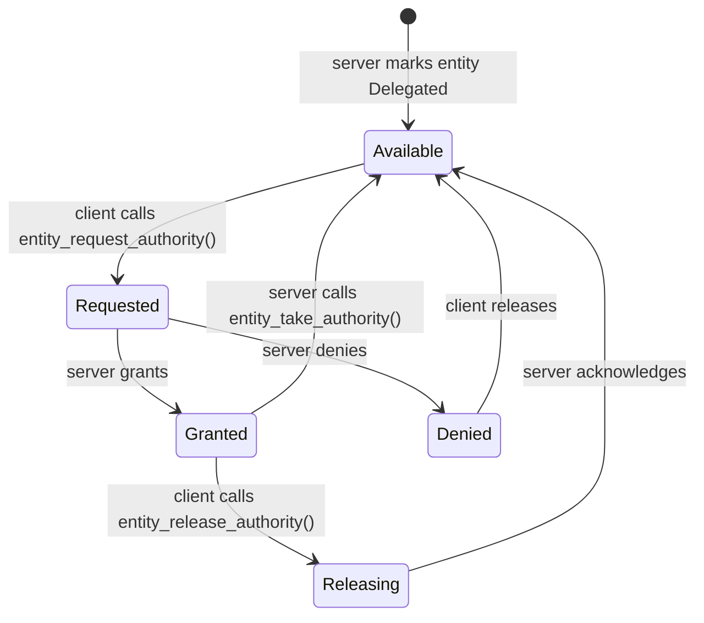

# Authority Delegation

By default, server-spawned replicated entities are server-owned. **Delegation**
allows a client to take temporary write authority over a specific entity or
resource. While the client holds authority, its mutations replicate back to the
server instead of the other way around.

Delegation is related to, but separate from, client-authoritative entities. A
client-owned published entity can be migrated into delegated state; after that
migration it is server-owned and follows the same grant/deny/revoke rules as
any other delegated entity.

---

## Authority state machine



---

## Trust model

- The server may **revoke** authority at any time by calling
  `entity_take_authority`.
- The client **never** holds unrevocable ownership.
- Mutations from a client-held delegated entity should still be validated
  server-side before applying to authoritative game state. naia replicates what
  the client sends; it does not validate or clamp values.

> **Danger:** naia does not validate client mutations. If a client has authority over a
> `Position` component, it can send any coordinate it likes. Always range-check
> and sanity-validate delegated values on the server before applying them to
> authoritative game state.

---

## Server setup

```rust
// Mark entity as delegatable when spawning:
server.spawn_entity(&mut world)
    .insert_component(position)
    .configure_replication(ReplicationConfig::delegated());
```

With the Bevy adapter, the entity must first be registered with naia:

```rust
commands
    .spawn_empty()
    .enable_replication(&mut server)
    .configure_replication(ReplicationConfig::delegated())
    .insert(position);
```

If you skip `enable_replication()`, you have created a perfectly normal Bevy
entity. naia will politely ignore it, as requested.

---

## Client request flow

```rust
// Client: request authority
client.entity_mut(&mut world, &entity)
    .request_authority();

// Server event loop — handle grant/deny:
for (user_key, entity) in events.read::<EntityAuthGrantEvent>() {
    // The requesting client now has write authority.
    // The client's mutations will replicate to the server.
}

for (user_key, entity) in events.read::<EntityAuthDenyEvent>() {
    // Server denied the request; client stays in observer mode.
}
```

---

## Per-user authority

Only one client can hold authority over a given entity at a time. The server
controls who may request and who is granted authority. Treat request handling as
game logic: check the requesting user, current state, anti-cheat constraints, and
whether the entity is currently in that user's scope before granting.

---

## Delegated resources

Resources can also be delegated using `configure_resource` in the core server API
or `configure_replicated_resource` in Bevy:

```rust
server.configure_resource::<ScoreBoard, _>(&mut world,
    ReplicationConfig::delegated());
```

This lets a client request authority over singleton state through the same
authority-channel flow used for entities. On Bevy clients, use
`commands.request_resource_authority::<MyClientTag, ScoreBoard>()` after the
resource is present locally.

---

## Relationship to `Publicity`

On the client side, the `Publicity` enum controls how a locally created entity
is visible to the server:

```rust
use naia_client::Publicity;
client.entity_mut(&mut world, &entity)
    .configure_replication(Publicity::Public);
```

`Publicity::Private` and `Publicity::Public` are both client-owned replicated
states: private reaches the server only, public may also be fanned out to other
in-scope clients. `Publicity::Delegated` migrates the entity into the delegated
authority model, where the server owns the entity and authority can be granted
or revoked.
