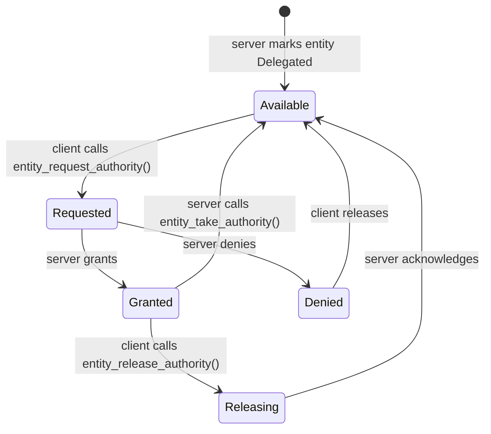

# Authority Delegation

By default the server owns all component state. **Delegation** allows a client
to take temporary write authority over a specific entity — while it holds
authority its mutations replicate back to the server instead of the other way
around.

---

## Authority state machine



---

## Trust model

- The server may **revoke** authority at any time by calling
  `entity_take_authority`.
- The client **never** holds unrevocable ownership.
- Mutations from a client-authoritative entity should still be validated
  server-side before applying to authoritative game state. naia replicates
  what the client sends — it does not validate or clamp values.

> **Danger:** naia does not validate client mutations. If a client has authority over a
> `Position` component, it can send any coordinate it likes. Always range-check
> and sanity-validate delegated values on the server before applying them to
> authoritative game state.

---

## Server setup

```rust
// Mark entity as delegatable when spawning:
server.spawn_entity(&mut world)
    .insert_component(position)
    .configure_replication(ReplicationConfig::delegated());
```

---

## Client request flow

```rust
// Client: request authority
client.entity_mut(&mut world, &entity)
    .request_authority();

// Server event loop — handle grant/deny:
for (user_key, entity) in events.read::<EntityAuthGrantEvent>() {
    // The requesting client now has write authority.
    // The client's mutations will replicate to the server.
}

for (user_key, entity) in events.read::<EntityAuthDenyEvent>() {
    // Server denied the request; client stays in observer mode.
}
```

---

## Per-user authority

Only one client can hold authority over a given entity at a time. The server
controls who may request and who is granted authority. Common patterns:

- **Owner lock** — only the entity's owner user key is allowed to hold authority.
- **Hot-potato** — authority is transferred between clients as turn-taking demands.
- **Claim-on-proximity** — server auto-grants to the nearest user and revokes
  when another user comes closer.

---

## Delegated resources

Resources can also be delegated using `configure_resource`:

```rust
server.configure_resource::<ScoreBoard, _>(&mut world,
    ReplicationConfig::delegated());
```

This allows a designated admin client (e.g. a headless bot or game master) to
mutate server-wide state through the normal replication path.

---

## Relationship to `Publicity`

On the client side, the `Publicity` enum controls how a locally created entity
is visible to the server:

```rust
use naia_client::Publicity;
client.entity_mut(&mut world, &entity)
    .configure_replication(Publicity::Public);
```

`Publicity::Public` entities are replicated from the client to the server.
`Publicity::Private` keeps them purely local. This is distinct from authority
delegation — it controls *client-created* entities, not server-created delegated ones.
