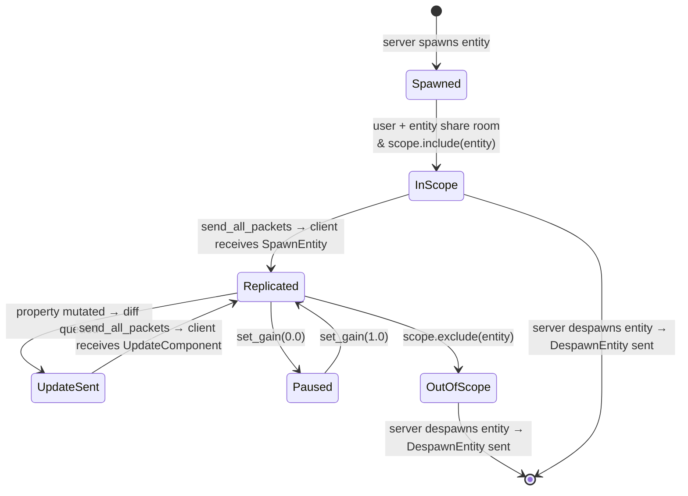

# Entity Publishing

Entity publishing controls whether and how a server-spawned entity is replicated
to clients. This chapter covers the full lifecycle: initial scope placement,
temporary replication pausing, and the relationship between server-side
`ReplicationConfig` and client-side `Publicity`.

---

## How replication starts

Entities are **not** replicated by default. An entity reaches a client only when
all three conditions are true simultaneously:

1. The entity and the user share at least one **room**.
2. The entity is **included** in the user's `UserScope`.
3. The entity has a `ReplicationConfig` that allows replication (the default).

The first two conditions are managed by rooms and scope (see
[Rooms & Scoping](../concepts/rooms.md)). The third — `ReplicationConfig` — is
what this chapter covers.

---

## `ReplicationConfig` variants

| Variant | Effect |
|---------|--------|
| `ReplicationConfig::default()` | Replicated to in-scope users (default for all spawned entities) |
| `ReplicationConfig::delegated()` | Marked as eligible for client authority requests (still replicated; see [Authority Delegation](delegation.md)) |

There is no `ReplicationConfig::Disabled` variant — to stop replicating an entity
you control scope membership or priority gain (see below).

```rust
// Default replication — no explicit call needed.
server.spawn_entity(&mut world)
    .insert_component(Position::new(0.0, 0.0));

// Mark as delegatable — client can request write authority.
server.spawn_entity(&mut world)
    .insert_component(position)
    .configure_replication(ReplicationConfig::delegated());
```

---

## Pausing replication without removing from scope

To temporarily stop sending updates for an entity — without despawning it or
changing its room membership — set its global priority gain to `0.0`:

```rust
// Stop replicating this entity (it stays in scope; clients see its last state).
server.global_entity_priority_mut(&entity).set_gain(0.0);

// Resume replication at normal rate.
server.global_entity_priority_mut(&entity).set_gain(1.0);

// Resume at 2× normal rate (useful for a burst catch-up after pausing).
server.global_entity_priority_mut(&entity).set_gain(2.0);
```

> **Tip:** Pausing replication via gain `0.0` is correct for entities that are
> temporarily hidden (behind a wall, in a fog-of-war zone). The entity stays in
> the client's scope, so re-enabling replication is instant — no spawn/despawn
> round-trip.

See [Priority-Weighted Bandwidth](../advanced/bandwidth.md) for the full priority API.

---

## Removing from scope entirely

To completely hide an entity from a specific user, either:

- **Exclude from UserScope:** `server.user_scope_mut(&user_key).exclude(&entity)`
  — the client receives a `DespawnEntityEvent` (or the entity is frozen in place
  if `ScopeExit::Persist` is configured).
- **Remove from all shared rooms:** remove both the entity and the user from every
  room they share.

See [Rooms & Scoping](../concepts/rooms.md) for the scope management API.

---

## Replicated resources

Replicated resources bypass the room/scope system entirely — they are always
visible to every connected user:

```rust
// Dynamic (diff-tracked) resource:
server.insert_resource(&mut world, ScoreBoard::new(), false)?;

// Static (immutable, sent once per connection) resource:
server.insert_resource(&mut world, MapMetadata::new(), true)?;

// Remove later:
server.remove_resource::<ScoreBoard, _>(&mut world);
```

Resources can also be marked delegatable using `configure_resource`:

```rust
server.configure_resource::<ScoreBoard, _>(
    &mut world,
    ReplicationConfig::delegated(),
);
```

See [Entity Replication — Replicated Resources](../concepts/replication.md#replicated-resources)
for the full resource API.

---

## Static vs dynamic replication

**Dynamic entities** (the default) use per-field delta tracking — only changed
`Property<T>` fields are sent each tick.

**Static entities** skip delta tracking. A full snapshot is sent when the entity
enters scope; no further updates are ever sent:

```rust
server.spawn_entity(&mut world)
    .as_static()              // must be called BEFORE insert_component
    .insert_component(tile);
```

Use static entities for map geometry, level tiles, or any data that never changes
after the initial spawn.

> **Danger:** Mutating a `Property<T>` on a static entity after spawn has no effect
> on connected clients — the mutation is never sent. Only use static entities for
> truly immutable data.

---

## Client-side `Publicity` — client-created entities

On the **client side**, the `Publicity` enum controls whether a locally created
entity is replicated back to the server:

```rust
use naia_client::Publicity;

// Client creates an entity and publishes it to the server:
client.entity_mut(&mut world, &entity)
    .insert_component(MyComponent { value: 42.into() })
    .configure_replication(Publicity::Public);

// Keep the entity purely client-local (default):
client.entity_mut(&mut world, &entity)
    .configure_replication(Publicity::Private);
```

`Publicity` is distinct from `ReplicationConfig` — it controls client-created
entities flowing *to* the server, whereas `ReplicationConfig` controls
server-created entities flowing *to* clients.

See [Client-Owned Entities](client-owned.md) for the full `Publicity` API.

---

## Lifecycle summary


