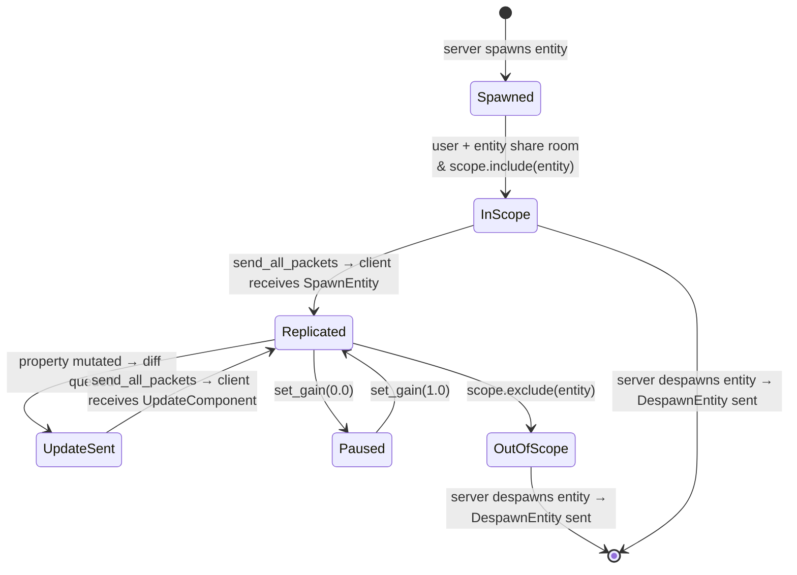

# Entity Publishing

Entity publishing controls whether and how a replicated entity is visible beyond
its owner. This chapter covers initial scope placement, temporary replication
pausing, replicated resources, and the relationship between server-side
`ReplicationConfig` and client-side `Publicity`.

---

## How replication starts

In Bevy, an entity is not considered by naia until you call
`enable_replication()`. After that, a server-owned entity reaches a client only
when all three conditions are true simultaneously:

1. The entity and the user share at least one **room**.
2. The entity is **included** in the user's `UserScope`.
3. The entity has a `ReplicationConfig` that allows replication.

The first two conditions are managed by rooms and scope (see
[Rooms & Scoping](../concepts/rooms.md)). The third — `ReplicationConfig` — is
what this chapter covers.

---

## `ReplicationConfig` variants

| Variant | Effect |
|---------|--------|
| `ReplicationConfig::public()` / default | Replicated to in-scope users |
| `ReplicationConfig::private()` | Client-owned unpublished state; not used for ordinary server-spawned public entities |
| `ReplicationConfig::delegated()` | Marked as eligible for client authority requests (still replicated; see [Authority Delegation](delegation.md)) |

There is no `ReplicationConfig::Disabled` variant — to stop replicating an entity
you control scope membership or priority gain (see below).

```rust
use naia_bevy_server::{CommandsExt, ReplicationConfig};

// Default replication.
commands
    .spawn_empty()
    .enable_replication(&mut server)
    .insert(Position::new(0.0, 0.0));

// Mark as delegatable — client can request write authority.
commands
    .spawn_empty()
    .enable_replication(&mut server)
    .configure_replication(ReplicationConfig::delegated())
    .insert(position);
```

---

## Pausing replication without removing from scope

To temporarily stop sending updates for an entity — without despawning it or
changing its room membership — set its global priority gain to `0.0`:

```rust
// Stop replicating this entity (it stays in scope; clients see its last state).
server.global_entity_priority_mut(&entity).set_gain(0.0);

// Resume replication at normal rate.
server.global_entity_priority_mut(&entity).set_gain(1.0);

// Resume at 2× normal rate (useful for a burst catch-up after pausing).
server.global_entity_priority_mut(&entity).set_gain(2.0);
```

> **Tip:** Pausing replication via gain `0.0` is correct for entities that are
> temporarily hidden (behind a wall, in a fog-of-war zone). The entity stays in
> the client's scope, so re-enabling replication is instant — no spawn/despawn
> round-trip.

See [Priority-Weighted Bandwidth](../advanced/bandwidth.md) for the full priority API.

---

## Removing from scope entirely

To completely hide an entity from a specific user, either:

- **Exclude from UserScope:** `server.user_scope_mut(&user_key).exclude(&entity)`
  — the client receives a `DespawnEntityEvent` (or the entity is frozen in place
  if `ScopeExit::Persist` is configured).
- **Remove from all shared rooms:** remove both the entity and the user from every
  room they share.

See [Rooms & Scoping](../concepts/rooms.md) for the scope management API.

---

## Replicated resources

Replicated resources bypass the room/scope system entirely. A resource is a
singleton replicated to connected clients without manually adding a hidden entity
to rooms or user scopes:

```rust
use naia_bevy_server::ServerCommandsExt;

// Dynamic (diff-tracked) resource:
commands.replicate_resource(ScoreBoard::new());

// Static (immutable, sent once per connection) resource:
commands.replicate_resource_static(MapMetadata::new());

// Remove later:
commands.remove_replicated_resource::<ScoreBoard>();
```

Resources can also be marked delegatable using `configure_replicated_resource`:

```rust
use naia_bevy_server::{ReplicationConfig, ServerCommandsExt};

commands.configure_replicated_resource::<ScoreBoard>(ReplicationConfig::delegated());
```

See [Entity Replication — Replicated Resources](../concepts/replication.md#replicated-resources)
for the full resource API.

---

## Static vs dynamic replication

**Dynamic entities** (the default) use per-field delta tracking — only changed
`Property<T>` fields are sent each tick.

**Static entities** skip delta tracking. A full snapshot is sent when the entity
enters scope; no further updates are ever sent:

```rust
use naia_bevy_server::CommandsExt;

commands
    .spawn_empty()
    .as_static() // call before inserting replicated components
    .insert(tile);
```

Use static entities for map geometry, level tiles, or any data that never changes
after the initial spawn.

> **Danger:** Mutating a `Property<T>` on a static entity after spawn has no effect
> on connected clients — the mutation is never sent. Only use static entities for
> truly immutable data.

---

## Client-side `Publicity` — client-created entities

On the **client side**, the `Publicity` enum controls whether a locally created
entity is replicated back to the server:

```rust
use naia_bevy_client::{Client, CommandsExt, Publicity};

// Client creates an entity and publishes it to the server:
commands
    .spawn_empty()
    .enable_replication(&mut client)
    .configure_replication::<Main>(Publicity::Public)
    .insert(MyComponent { value: 42.into() });

// Keep the entity private to the server/owner relationship (default):
commands
    .entity(entity)
    .configure_replication::<Main>(Publicity::Private);
```

`Publicity::Private` still lets the entity replicate to the server; it prevents
the server from also publishing that entity to other clients. For a truly local
entity, do not enable naia replication for it.

`Publicity` is distinct from `ReplicationConfig`: it controls client-created
entities flowing *to* the server and possibly out to peers, whereas
`ReplicationConfig` controls server-owned entities/resources flowing *to*
clients and whether they are delegable.

See [Client-Owned Entities](client-owned.md) for the full `Publicity` API.

---

## Lifecycle summary


