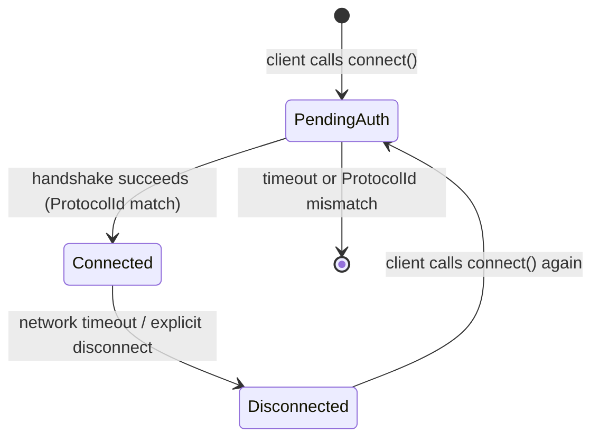

# Connection Lifecycle

A naia connection passes through a well-defined set of states from the initial
handshake through to disconnection and optional reconnect.

> **Core API:** Not using Bevy? The bare `naia-server` / `naia-client` API is
> identical in concept but uses a direct method-call style instead of Bevy
> systems. See [Core API Overview](../adapters/overview.md).

---

## Connection state machine



---

## Transport layer

naia's transport layer is pluggable. Two implementations ship out of the box:

| Target | Implementation | Socket type | Encryption |
|--------|----------------|-------------|------------|
| Native (Linux/macOS/Windows) | WebRTC data channel | `transport_webrtc` | DTLS |
| Browser (`wasm32-unknown-unknown`) | WebRTC data channel | `transport_webrtc` | DTLS |
| Native dev / trusted LAN | UDP datagram socket | `transport_udp` | None |
| Same-process tests | In-process queues | `transport_local` | n/a |

> **Warning:** `transport_udp` sends all packets as **unencrypted plaintext**. Use it for
> local development and trusted private networks only. See
> [Security & Trust Model](../reference/security.md) for production guidance.

The `Server` and `Client` APIs are identical for shipped transports — only
the `Socket` value passed to `listen` / `connect` differs:

```rust
use naia_bevy_server::{transport::webrtc, Server};
use naia_bevy_client::Client;

// Bevy startup system — native server accepting native and browser clients:
fn startup_server(mut server: Server) {
    let socket = webrtc::Socket::new(&webrtc::ServerAddrs::default(), server.socket_config());
    server.listen(socket);
}

// Bevy startup system — native or browser client:
fn startup_client(mut client: Client) {
    let socket = webrtc::Socket::new("http://127.0.0.1:14191", client.socket_config());
    client.connect(socket);
}
```

For Wasm builds, add the Rust Wasm target and build with `wasm-pack` or `trunk`.
The protocol, channel config, and all game logic are identical.

---

## Heartbeats and timeout detection

naia sends automatic heartbeats when no other packets are outgoing. If a
client stops responding for longer than the configured timeout window, the server
fires a `DisconnectEvent` for that user and reclaims all associated resources.

The timeout is controlled by `ServerConfig` / `ClientConfig`:

```rust
use naia_bevy_server::ServerConfig;
use std::time::Duration;

let mut config = ServerConfig::default();
// Disconnect a client after 10 seconds with no response.
config.connection.disconnection_timeout_duration = Duration::from_secs(10);
```

The default timeout is 10 seconds. Lower values catch dead connections faster
but may cause false positives on brief network outages.

---

## Network condition simulation

`LinkConditionerConfig` simulates packet loss, latency, and jitter — useful for
testing replication robustness and prediction/rollback in a local dev loop
without a real bad network.

```rust
use naia_bevy_shared::LinkConditionerConfig;

// Custom profile:
let lag = LinkConditionerConfig::new(
    100,   // incoming_latency ms
    25,    // incoming_jitter ms
    0.02,  // incoming_loss (2%)
);

// Or use a named preset:
let lag = LinkConditionerConfig::poor_condition();

// Pass the conditioner to a transport socket that accepts it, such as UDP or
// the local test transport.
```

Named presets:

| Preset | Latency (ms) | Jitter (ms) | Loss |
|--------|-------------|-------------|------|
| `perfect_condition()` | 1 | 0 | 0% |
| `very_good_condition()` | 12 | 3 | 0.1% |
| `good_condition()` | 40 | 10 | 0.2% |
| `average_condition()` | 100 | 25 | 2% |
| `poor_condition()` | 200 | 50 | 4% |
| `very_poor_condition()` | 300 | 75 | 6% |

> **Tip:** To simulate a bidirectional bad link, pass the same config to both the server
> and client sockets. To simulate an asymmetric path (e.g. worse upload), use
> different configs on each side.

---

## Reconnection

When a client disconnects and reconnects, call `client.connect(socket)` again
after receiving the `DisconnectEvent`. naia restarts the full handshake sequence
and the server fires a new `ConnectEvent` for the user.

```rust
use bevy::ecs::message::MessageReader;
use naia_bevy_client::{
    transport::webrtc,
    Client, DefaultClientTag,
    events::DisconnectEvent,
};

// Bevy system — handle disconnect and reconnect:
fn handle_disconnect(
    mut commands: Commands,
    mut client: Client<DefaultClientTag>,
    mut disconnect_reader: MessageReader<DisconnectEvent<DefaultClientTag>>,
    replicated_entities: Query<Entity, With<ReplicatedMarker>>,
) {
    for _ in disconnect_reader.read() {
        // Clear all server-replicated entities from your local world.
        // naia does NOT do this automatically on disconnect.
        for entity in replicated_entities.iter() {
            commands.entity(entity).despawn_recursive();
        }

        // Reconnect — naia will re-run the full handshake.
        let socket = webrtc::Socket::new("http://127.0.0.1:14191", client.socket_config());
        client.connect(socket);
    }
}
```

**What naia handles automatically on reconnect:**

- Full handshake re-negotiation and protocol hash check.
- Re-scoping: all entities currently in the user's rooms and scope will be
  re-sent as fresh `SpawnEntityEvent` + `InsertComponentEvent` sequences.
- Replicated resources: re-delivered as if the client is connecting for the
  first time.

**What the application must handle:**

- Despawning stale local entities from the previous session before or
  immediately after reconnecting.
- Any client-local state tied to the old session (auth tokens, predicted
  entities, `CommandHistory` buffers).
- Retry backoff. naia does not implement reconnection backoff; a simple timer
  resource in your game loop is sufficient.

> **Danger:** If you reconnect without despawning the stale entities, you will end up with
> duplicate entities — one set from the old session (never despawned) and one
> set re-sent by the server on the new connection.
