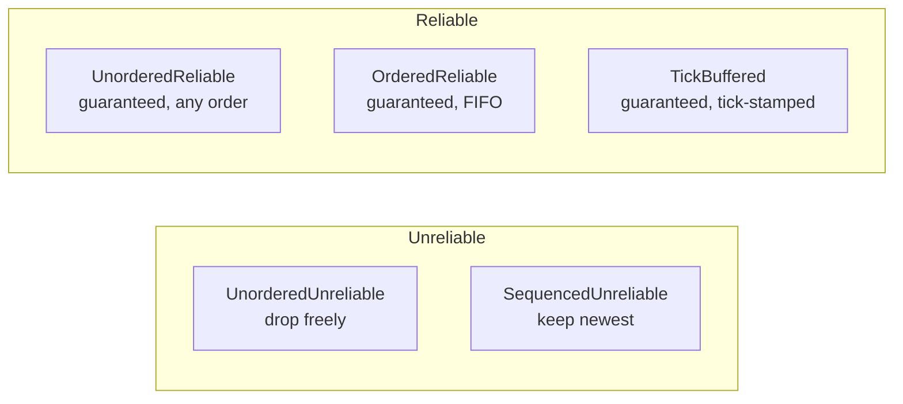

# Messages & Channels

All messages and entity actions are routed through typed channels. A channel is
a named type that derives `Channel` and is registered in the `Protocol` with a
`ChannelMode` and `ChannelDirection`.

---

## Channel modes

| Mode | Ordering | Reliability | Typical use |
|------|----------|-------------|-------------|
| `UnorderedUnreliable` | None | None | Fire-and-forget telemetry |
| `SequencedUnreliable` | Newest-wins | None | Position updates (drop stale) |
| `UnorderedReliable` | None | Guaranteed | One-off notifications |
| `OrderedReliable` | FIFO | Guaranteed | Chat, game events |
| `TickBuffered` | Per tick | Guaranteed | Client input (tick-stamped) |
| Bidirectional + Reliable | FIFO | Guaranteed | Request / response pairs |

---

## Channel reliability diagram



---

## Custom channels

```rust
#[derive(Channel)]
pub struct PlayerInputChannel;

// In protocol builder:
.add_channel::<PlayerInputChannel>(
    ChannelDirection::ClientToServer,
    ChannelMode::TickBuffered(Default::default()),
)
```

---

## Sending and receiving messages

Any struct that derives `Message` can be sent through a message channel:

```rust
#[derive(Message)]
pub struct ChatMessage {
    pub text: String,
    pub sender: u32,
}
```

Register the type in your `Protocol` builder:

```rust
Protocol::builder()
    .add_message::<ChatMessage>()
    .build()
```

Then send and receive:

```rust
// Server → specific client:
server.send_message::<GameChannel, ChatMessage>(&user_key, &msg)?;

// Client → server:
client.send_message::<GameChannel, ChatMessage>(&msg);

// Client receive:
for event in events.read::<MessageEvent<GameChannel, ChatMessage>>() {
    println!("{}", *event.message.text);
}
```

> **Note:** `Message` types do **not** use `Property<>` wrappers — that wrapper is only for
> `Replicate` components that participate in per-field delta tracking. Message
> fields are serialized in full each time the message is sent.

---

## TickBuffered channels

`TickBuffered` stamps every message with the client tick at which the input
occurred. The server buffers them and delivers them via
`receive_tick_buffer_messages(tick)` when the server tick matches. This enables
tick-accurate input replay and is the foundation of client-side prediction.

```rust
// Server tick handler:
let mut messages = server.receive_tick_buffer_messages(&server_tick);
for (_user_key, command) in messages.read::<PlayerInputChannel, KeyCommand>() {
    // command arrived at exactly the right simulation step
}
```

> **Warning:** Commands that arrive **after** their target tick has already executed are
> discarded silently. The client's normal correction handler handles this as an
> ordinary misprediction — see [Client-Side Prediction & Rollback](../advanced/prediction.md).

---

## Backpressure

`ReliableSettings::max_queue_depth` caps the unacknowledged message queue.
`send_message` returns `Err(MessageQueueFull)` when the limit is reached.
This prevents a slow or disconnected client from causing unbounded memory growth
on the server.

```rust
if let Err(e) = server.send_message::<GameChannel, _>(&user_key, &msg) {
    // user disconnected or queue is full — safe to ignore or log
}
```
