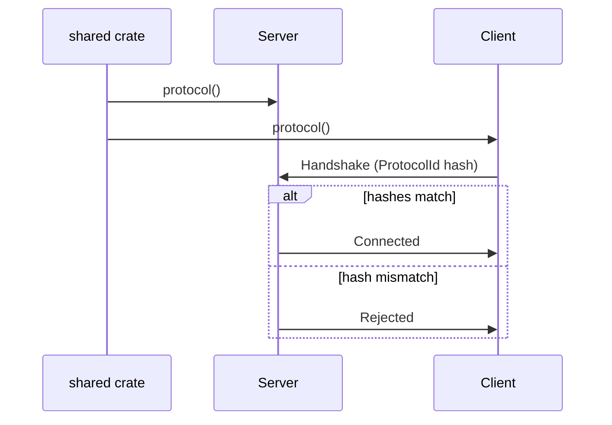

# The Shared Protocol

Both the server and the client must agree on the complete set of replicable
component types, message types, channel configurations, and protocol-level
settings. In naia this agreement is expressed as a `Protocol` value and enforced
at connection time via a deterministic hash.

> **Core API:** Not using Bevy? The bare `naia-server` / `naia-client` API is
> identical in concept but uses a direct method-call style instead of Bevy
> systems. See [Core API Overview](../adapters/overview.md).

Conventionally you put `Protocol` construction in a shared crate:

```rust
use naia_shared::{Protocol, ChannelMode, ChannelDirection};

pub fn protocol() -> Protocol {
    Protocol::builder()
        .tick_interval(std::time::Duration::from_millis(40)) // 25 Hz
        .add_component::<Position>()
        .add_component::<Health>()
        .add_message::<ChatMessage>()
        .add_channel::<GameChannel>(
            ChannelDirection::Bidirectional,
            ChannelMode::OrderedReliable(Default::default()),
        )
        .build()
}
```

Both the server and the client call this same function. With Bevy, pass the
result to the plugins at startup:

```rust
use bevy::prelude::*;
use naia_bevy_server::{Plugin as NaiaServerPlugin, ServerConfig};
use naia_bevy_client::{ClientConfig, Plugin as NaiaClientPlugin};
use my_game_shared::protocol;

// Server app
App::new()
    .add_plugins(NaiaServerPlugin::new(ServerConfig::default(), protocol()));

// Client app
App::new()
    .add_plugins(NaiaClientPlugin::new(ClientConfig::default(), protocol()));
```

naia derives a deterministic `ProtocolId` from the registered types and channel
configuration; a client whose ID does not match the server's will be rejected
during the handshake.

> **Danger:** If the server and client `Protocol` values disagree — even a single
> missing `add_component` call — the handshake fails silently from the client's
> perspective. Always build the `Protocol` from a **shared crate** imported by
> both sides.

**The shared crate** typically contains:
- `Protocol` construction
- All `#[derive(Replicate)]` component types
- All `#[derive(Message)]` / `#[derive(Request, Response)]` types
- Custom `#[derive(Channel)]` marker types

---

## Entities and Components

With the Bevy adapter, an entity is a standard `bevy::Entity`. naia tracks the
entity in its replication set after you call `commands.enable_replication(&mut server)`.

**Replicated components** must derive `Replicate`:

```rust
#[derive(Replicate)]
pub struct Position {
    pub x: Property<f32>,
    pub y: Property<f32>,
}
```

`Property<T>` is naia's change-detection wrapper. When a field inside
`Property<T>` is mutated, the containing entity is marked dirty and the diff is
queued for transmission on the next `send_all_packets` call. Only changed fields
are sent — naia tracks per-field diffs for each in-scope user.

> **Tip:** Wrap tightly coupled multi-axis state in a single `Property<State>` struct
> rather than separate `Property<f32>` fields. One dirty-bit covers the whole
> struct, preventing partial-update inconsistencies between axes.

---

## Protocol flow diagram



---

## Registration order

Components, messages, and channels are registered by type. The `ProtocolId`
hash is computed from the set of registered types — **order within the builder
does not matter for the hash**, but the set must be identical on both sides.

> **Note:** The `ProtocolId` is computed at startup, not at compile time. If you
> conditionally register components based on a feature flag, ensure the flag is
> set identically for the server and client builds.
