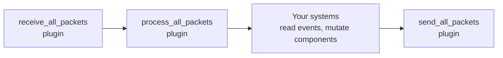

# Entity Replication

Entity replication is the core mechanism by which the server's game state is
delivered to connected clients. naia tracks which entities are in each user's
scope and automatically sends only the changed fields each tick.

> **Core API:** Not using Bevy? The bare `naia-server` / `naia-client` API is
> identical in concept but uses a direct method-call style instead of Bevy
> systems. See [Core API Overview](../adapters/overview.md).

---

## The Replication Loop

Internally naia runs these five steps in order every frame:

```
receive_all_packets     – read UDP/WebRTC datagrams from the OS
process_all_packets     – decode packets; apply client mutations
                          (Bevy events are populated here)
[YOUR SYSTEMS]          – read events, mutate components
send_all_packets        – serialise diffs + messages; flush to network
```

With the Bevy adapter, `NaiaServerPlugin` and `NaiaClientPlugin` own
`receive_all_packets`, `process_all_packets`, and `send_all_packets`. Your
systems run between `process_all_packets` and `send_all_packets` automatically —
you never call those methods directly.

The equivalent Bevy system ordering looks like this:



> **Danger:** `send_all_packets` must be the **last** step. The plugin enforces
> this. In the bare core API, calling it inside a tick loop adds a full tick of
> latency to every component update.

---

## Spawning a replicated entity

With the Bevy adapter, use `CommandsExt::enable_replication`:

```rust
use naia_bevy_server::CommandsExt;

let entity = commands
    .spawn_empty()
    .enable_replication(&mut server)   // registers entity with naia
    .insert(Position::new(0.0, 0.0))  // initial component value
    .id();
```

On the next `send_all_packets`, naia sends a `SpawnEntity` packet to every
in-scope client with the initial component values.

To despawn a replicated entity, call `commands.entity(entity).despawn()`. naia
detects the despawn and sends `DespawnEntity` to all in-scope clients.

---

## Replication state machine

```mermaid
stateDiagram-v2
    [*] --> OutOfScope : entity spawned
    OutOfScope --> InScope : scope.include(entity)
    InScope --> OutOfScope : scope.exclude(entity) [ScopeExit::Despawn]
    InScope --> Frozen : scope.exclude(entity) [ScopeExit::Persist]
    Frozen --> InScope : scope.include(entity)
    InScope --> [*] : server despawns entity

    InScope --> InScope : property mutated → diff sent
```

---

## Receiving replication events on the client

On the client, Bevy events fire as naia processes incoming packets:

```rust
use naia_bevy_client::events::{
    SpawnEntityEvent, DespawnEntityEvent,
    InsertComponentEvent, UpdateComponentEvent,
};
use my_game_shared::Position;

fn handle_replication_events(
    mut spawn_reader: EventReader<SpawnEntityEvent>,
    mut despawn_reader: EventReader<DespawnEntityEvent>,
    mut insert_reader: EventReader<InsertComponentEvent<Position>>,
    mut update_reader: EventReader<UpdateComponentEvent<Position>>,
    positions: Query<&Position>,
) {
    for SpawnEntityEvent(entity) in spawn_reader.read() {
        println!("Entity spawned: {:?}", entity);
    }

    for DespawnEntityEvent(entity) in despawn_reader.read() {
        println!("Entity despawned: {:?}", entity);
    }

    for InsertComponentEvent(entity) in insert_reader.read() {
        if let Ok(pos) = positions.get(*entity) {
            println!("Position inserted: ({:.2}, {:.2})", *pos.x, *pos.y);
        }
    }

    for UpdateComponentEvent(entity) in update_reader.read() {
        if let Ok(pos) = positions.get(*entity) {
            println!("Position updated: ({:.2}, {:.2})", *pos.x, *pos.y);
        }
    }
}
```

The `Position` component on the client entity is a standard Bevy component. naia
writes the latest server values into it before your systems run.

---

## Static vs Dynamic Entities

**Dynamic entities** (the default) use per-field delta tracking. When any
`Property<T>` field changes, only the changed fields are sent to each in-scope
user on the next `send_all_packets` call.

**Static entities** skip delta tracking entirely. When a static entity enters
a user's scope, naia sends a full component snapshot. After that no further
updates are transmitted — static entities are assumed to be immutable for the
lifetime of the session.

Create a static entity with Bevy:

```rust
// Bevy adapter — call as_static() on the EntityCommands before inserting components.
commands
    .spawn_empty()
    .enable_replication(&mut server)
    .as_static()        // must be called BEFORE insert
    .insert(tile);
```

> **Tip:** Use static entities for map tiles, level geometry, or any entity written once
> and never changed. They eliminate diff tracking and save significant CPU time
> on servers with many entities.

---

## Replicated Resources

A **replicated resource** is a server-side singleton that is automatically
visible to all connected users, without room membership or scope management.
Internally naia creates a hidden one-component entity to carry the value.

```rust
// Insert a dynamic (diff-tracked) resource:
server.insert_resource(&mut world, ScoreBoard::new(), false)?;

// Insert a static (immutable) resource:
server.insert_resource(&mut world, MapMetadata::new(), true)?;

// Remove it later:
server.remove_resource::<ScoreBoard, _>(&mut world);
```

On the client:

```rust
if client.has_resource::<ScoreBoard>() {
    let entity = client.resource_entity::<ScoreBoard>().unwrap();
    // read component from world storage using entity
}
```

Resources differ from ordinary entities in three ways:

- No room or scope configuration is needed.
- At most one resource per type can exist at a time (inserting a duplicate
  returns `Err(ResourceAlreadyExists)`).
- They can be delegated just like entities by calling `configure_resource`.

---

## Multi-Server / Zone Architecture

naia is a single-process authority. For games that need horizontal scaling
(e.g. an open world split across geographic zones), the standard pattern is
**zone sharding at the application layer**:

```
Zone A server (naia process)          Zone B server (naia process)
  owns entities in region A             owns entities in region B
        │                                       │
        └───── coordination service ────────────┘
                 (entity hand-off, cross-zone messages, matchmaking)
```

When a player moves between zones the application:

1. Serializes the player's replicated state on the source server.
2. Sends the state to the destination server via your coordination channel.
3. Despawns the entity on the source server (client gets a despawn event).
4. Spawns the entity on the destination server and places the player's
   connection in the new room.

> **Note:** naia provides the per-process primitive (`spawn_entity`, rooms, scopes,
> authority). Zone coordination is an application concern.
