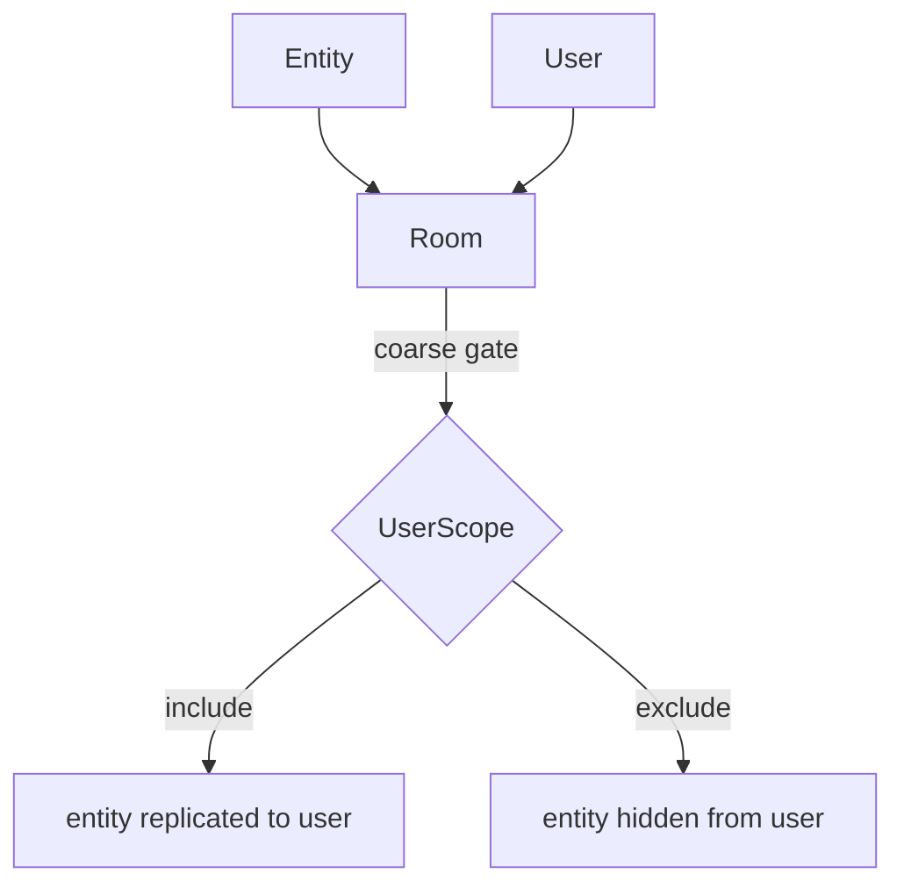

# Rooms & Scoping

Entity replication uses a two-level scoping model. Both levels must allow
replication before an entity is sent to a user.

---

## Two-level scoping diagram



---

## Room membership (coarse)

A user and an entity must share at least one room before replication is
possible. This is the broad spatial or logical partition — a game "zone", a
match instance, a lobby.

```rust
let room = server.create_room();
let room_key = room.key();

server.room_mut(&room_key).add_user(&user_key);
server.room_mut(&room_key).add_entity(&entity);
```

> **Tip:** Think of rooms as match instances or game zones. All players in a match go into
> one room; their entities go in the same room. A player moving between zones moves
> their user key (and their entities) between rooms.

---

## UserScope (fine-grained)

Within a shared room you can further restrict which entities replicate to which
users. The canonical pattern is a visibility callback:

```rust
// scope_checks_pending() returns only entities that may have changed scope.
// scope_checks_all() does a full re-evaluation of everything in scope.
for (room_key, user_key, entity) in server.scope_checks_pending() {
    let mut scope = server.user_scope_mut(&user_key);
    if is_visible(entity, user_key) {
        scope.include(&entity);
    } else {
        scope.exclude(&entity);
    }
}
server.mark_scope_checks_pending_handled();
```

---

## ScopeExit behavior

When an entity leaves a user's scope, naia's default behavior is to send a
despawn event to that client (`ScopeExit::Despawn`). The alternative is
`ScopeExit::Persist`, which freezes the entity's last known state on the client
without despawning it.

> **Note:** Use `ScopeExit::Persist` for entities that may re-enter scope frequently (e.g.
> enemies near the viewport edge). This avoids spawn/despawn round-trips and
> prevents the client from briefly seeing the entity "pop in" each time.

---

## Replicated resources bypass scoping

[Replicated resources](replication.md#replicated-resources) are visible to **all**
connected users automatically. No room membership or `UserScope` configuration
is required. They are the right choice for server-wide singletons like scoreboards
or match state.
