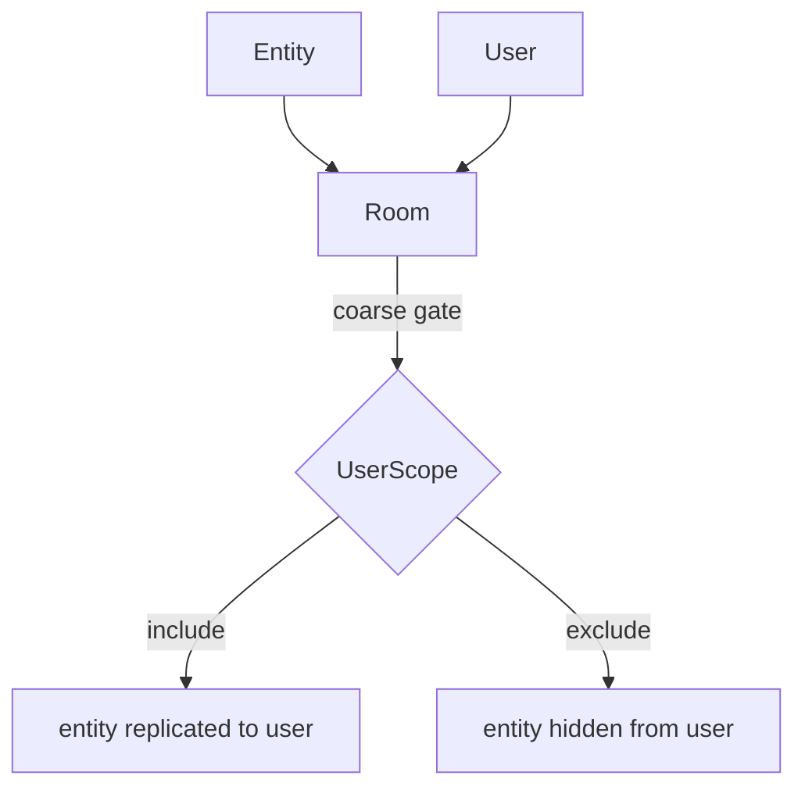

# Rooms & Scoping

Entity replication uses a two-level scoping model. Both levels must allow
replication before an entity is sent to a user.

> **Core API:** Not using Bevy? The bare `naia-server` / `naia-client` API is
> identical in concept but uses a direct method-call style instead of Bevy
> systems. See [Core API Overview](../adapters/overview.md).

---

## Two-level scoping diagram



---

## Room membership (coarse)

A user and an entity must share at least one room before replication is
possible. This is the broad spatial or logical partition — a game "zone", a
match instance, a lobby.

With the Bevy adapter, room operations happen inside a system that takes
`Server` as a `SystemParam`:

```rust
use naia_bevy_server::{CommandsExt, RoomKey, Server, events::ConnectEvent};
use my_game_shared::Position;

fn handle_connections(
    mut commands: Commands,
    mut server: Server,
    mut connect_reader: EventReader<ConnectEvent>,
    mut room_key: ResMut<Option<RoomKey>>,
) {
    let key = *room_key.get_or_insert_with(|| server.create_room().key());

    for ConnectEvent(user_key) in connect_reader.read() {
        let entity = commands
            .spawn_empty()
            .enable_replication(&mut server)
            .insert(Position::new(0.0, 0.0))
            .id();

        server.room_mut(&key).add_user(user_key);
        server.room_mut(&key).add_entity(&entity);
    }
}
```

> **Tip:** Think of rooms as match instances or game zones. All players in a match go into
> one room; their entities go in the same room. A player moving between zones moves
> their user key (and their entities) between rooms.

---

## UserScope (fine-grained)

Within a shared room you can further restrict which entities replicate to which
users. The canonical pattern is a visibility callback:

```rust
// scope_checks_pending() returns only entities that may have changed scope.
// scope_checks_all() does a full re-evaluation of everything in scope.
for (room_key, user_key, entity) in server.scope_checks_pending() {
    let mut scope = server.user_scope_mut(&user_key);
    if is_visible(entity, user_key) {
        scope.include(&entity);
    } else {
        scope.exclude(&entity);
    }
}
server.mark_scope_checks_pending_handled();
```

---

## Removing users and entities from rooms

To stop replicating an entity to a user, remove either side from the shared room:

```rust
// Remove a specific entity from the room (affects all users in that room).
server.room_mut(&room_key).remove_entity(&entity);

// Remove a user from the room (stops all replication for entities in that room
// unless the user and entity share another room).
server.room_mut(&room_key).remove_user(&user_key);
```

When a user is removed from the last room that contains an entity, the client
receives a `DespawnEntityEvent` for that entity (or the entity is frozen if
`ScopeExit::Persist` is configured).

---

## ScopeExit behavior

When an entity leaves a user's scope, naia's default behavior is to send a
despawn event to that client (`ScopeExit::Despawn`). The alternative is
`ScopeExit::Persist`, which freezes the entity's last known state on the client
without despawning it.

> **Note:** Use `ScopeExit::Persist` for entities that may re-enter scope frequently (e.g.
> enemies near the viewport edge). This avoids spawn/despawn round-trips and
> prevents the client from briefly seeing the entity "pop in" each time.

---

## Replicated resources bypass scoping

[Replicated resources](replication.md#replicated-resources) are visible to **all**
connected users automatically. No room membership or `UserScope` configuration
is required. They are the right choice for server-wide singletons like scoreboards
or match state.
