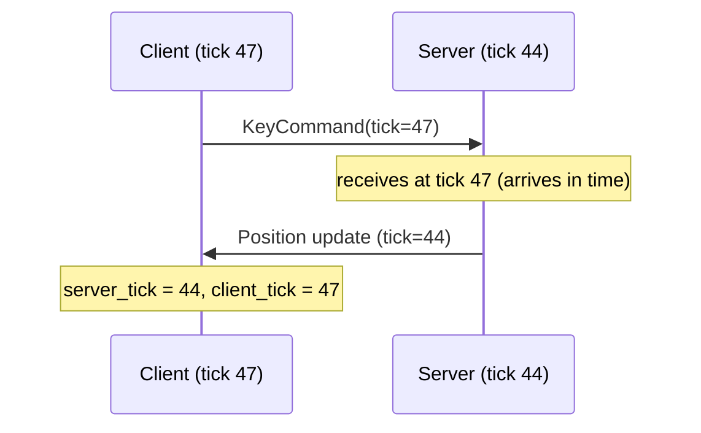

# Tick Synchronization

Ticks are the heartbeat of a naia simulation. The server advances a global tick
counter; the client maintains two tick streams that stay synchronized with the
server despite network jitter.

---

## Server ticks

The server tick interval is configured in the `Protocol`:

```rust
Protocol::builder()
    .tick_interval(Duration::from_millis(50)) // 20 Hz
```

`take_tick_events` advances the tick counter. Each elapsed server tick produces
a `TickEvent` that triggers the game simulation step. The server should mutate
replicated components inside the tick handler and call `send_all_packets` once
after all ticks in the batch are processed.

---

## Client ticks

The client maintains two tick streams:

- **Client tick** (`client_tick`) — the tick at which the client is *sending*,
  running slightly ahead of the server to account for travel time.
- **Server tick** (`server_tick`) — the server tick currently *arriving* at the
  client, behind the server's actual tick by RTT/2 + jitter.



Use `client_interpolation()` and `server_interpolation()` to compute the
sub-tick interpolation fraction `[0.0, 1.0)` for smooth rendering between
discrete tick states.

---

## Prediction and rollback

`TickBuffered` channels carry client input timestamped with the client tick.
The server delivers them via `receive_tick_buffer_messages(tick)`, enabling
rollback-and-replay: apply the server's authoritative update, then replay
buffered client inputs on top. `CommandHistory<M>` stores the input history
for this purpose.

> **Tip:** The client tick leading the server by ~RTT/2 is what makes tick-accurate input
> delivery possible. The `ClientConfig::minimum_latency` setting controls the
> minimum lead — increase it on high-jitter links to reduce tick-buffer misses.

For a complete step-by-step walkthrough of the full prediction loop, see
**[Client-Side Prediction & Rollback](../advanced/prediction.md)**.
