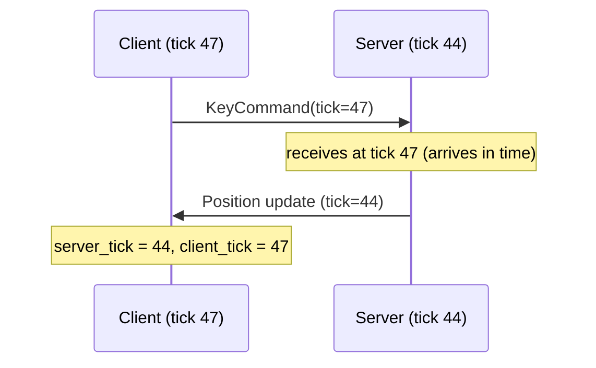

# Tick Synchronization

Ticks are the heartbeat of a naia simulation. The server advances a global tick
counter; the client maintains two tick streams that stay synchronized with the
server despite network jitter.

> **Core API:** Not using Bevy? The bare `naia-server` / `naia-client` API is
> identical in concept but uses a direct method-call style instead of Bevy
> systems. See [Core API Overview](../adapters/overview.md).

---

## Server ticks

The server tick interval is configured in the `Protocol`:

```rust
Protocol::builder()
    .tick_interval(Duration::from_millis(50)) // 20 Hz
```

With the Bevy adapter, each elapsed server tick fires a `ServerTickEvent`.
Mutate replicated components inside this system:

```rust
use naia_bevy_server::{Server, events::ServerTickEvent};
use my_game_shared::{InputChannel, PlayerInput, Position};

fn tick_system(
    mut server: Server,
    mut tick_reader: EventReader<ServerTickEvent>,
    mut positions: Query<&mut Position>,
) {
    for ServerTickEvent(server_tick) in tick_reader.read() {
        // Drain input for this exact tick.
        let mut messages = server.receive_tick_buffer_messages(server_tick);
        for (_user_key, _input) in messages.read::<InputChannel, PlayerInput>() {
            // apply input ...
        }

        // Advance simulation.
        for mut pos in positions.iter_mut() {
            *pos.x += 0.1;
        }
    }
    // NaiaServerPlugin calls send_all_packets after this system completes.
}
```

---

## Client ticks

The client maintains two tick streams:

- **Client tick** (`client_tick`) — the tick at which the client is *sending*,
  running slightly ahead of the server to account for travel time.
- **Server tick** (`server_tick`) — the server tick currently *arriving* at the
  client, behind the server's actual tick by RTT/2 + jitter.



Use `client_interpolation()` and `server_interpolation()` to compute the
sub-tick interpolation fraction `[0.0, 1.0)` for smooth rendering between
discrete tick states.

With the Bevy adapter, use `ClientTickEvent` to send input each tick:

```rust
use naia_bevy_client::{Client, events::ClientTickEvent};
use my_game_shared::{InputChannel, PlayerInput};

fn client_tick_system(
    mut client: Client,
    mut tick_reader: EventReader<ClientTickEvent>,
    keyboard: Res<ButtonInput<KeyCode>>,
) {
    for ClientTickEvent(_tick) in tick_reader.read() {
        let input = PlayerInput {
            up:    keyboard.pressed(KeyCode::KeyW),
            down:  keyboard.pressed(KeyCode::KeyS),
            left:  keyboard.pressed(KeyCode::KeyA),
            right: keyboard.pressed(KeyCode::KeyD),
        };
        client.send_tick_buffer_message::<InputChannel, _>(&input);
    }
}
```

---

## Prediction and rollback

`TickBuffered` channels carry client input timestamped with the client tick.
The server delivers them via `receive_tick_buffer_messages(tick)`, enabling
rollback-and-replay: apply the server's authoritative update, then replay
buffered client inputs on top. `CommandHistory<M>` stores the input history
for this purpose.

> **Tip:** The client tick leading the server by ~RTT/2 is what makes tick-accurate input
> delivery possible. The `ClientConfig::minimum_latency` setting controls the
> minimum lead — increase it on high-jitter links to reduce tick-buffer misses.

For a complete step-by-step walkthrough of the full prediction loop, see
**[Client-Side Prediction & Rollback](../advanced/prediction.md)**.
