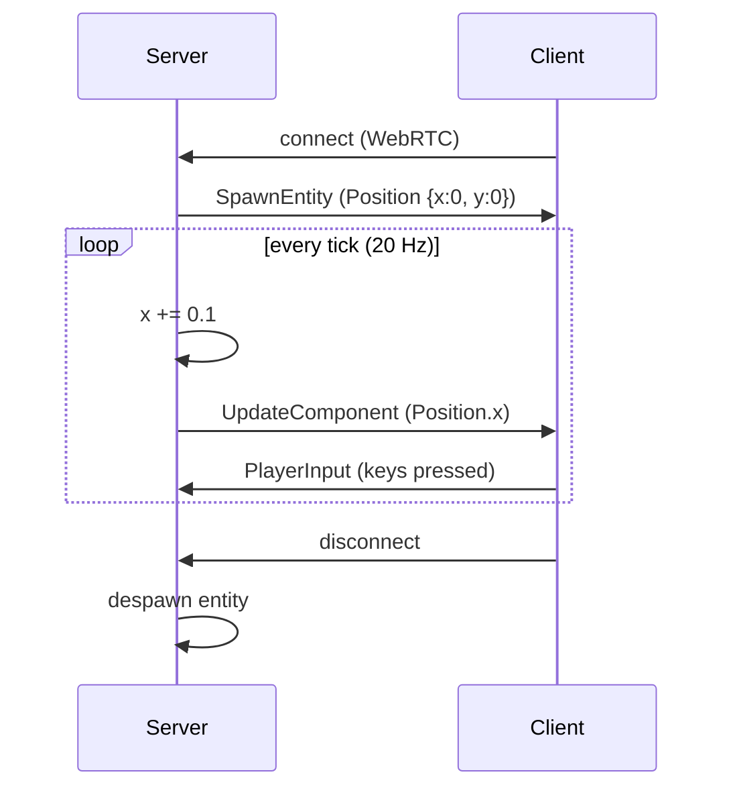

# Bevy Quick Start

In under five minutes you will have a live naia + Bevy server and client: the
server spawns a `Position` entity per connecting user and nudges it every tick;
the client receives real-time updates and prints them to the terminal.

> **Not using Bevy?** All of the networking concepts here apply to the bare
> `naia-server` / `naia-client` API too. See
> [Core API Overview](../adapters/overview.md) for the ECS-agnostic version.

---

## What we are building



---

## Workspace layout

```
my_game/
  Cargo.toml   ← workspace root
  shared/      ← protocol types shared by server + client
  server/      ← Bevy server binary
  client/      ← Bevy client binary
```

```toml
# Cargo.toml (workspace root)
[workspace]
members = ["shared", "server", "client"]
resolver = "2"
```

---

## Shared crate

The shared crate defines every type that both sides must agree on. naia derives a
deterministic `ProtocolId` hash from these registrations; a mismatch causes
handshake rejection.

```toml
# shared/Cargo.toml
[package]
name    = "my-game-shared"
version = "0.1.0"
edition = "2021"

[dependencies]
naia-bevy-shared = "0.25"
bevy_ecs = { version = "0.18", default-features = false }
```

```rust
// shared/src/lib.rs
use std::time::Duration;
use bevy_ecs::prelude::Component;
use naia_bevy_shared::{
    Channel, ChannelDirection, ChannelMode, Message, Property, Protocol, Replicate,
};

/// A replicated position component.
///
/// `Property<T>` wraps each field for per-field change detection. Only mutated
/// fields are included in the outbound diff — naia never sends the full struct
/// unless all fields changed simultaneously.
#[derive(Component, Replicate, Clone)]
pub struct Position {
    pub x: Property<f32>,
    pub y: Property<f32>,
}

impl Position {
    pub fn new(x: f32, y: f32) -> Self {
        Self {
            x: Property::new(x),
            y: Property::new(y),
        }
    }
}

/// A typed input message sent from client to server each tick.
///
/// Message fields are NOT wrapped in `Property<>` — messages are serialized in
/// full each send, not delta-tracked.
#[derive(Message, Clone)]
pub struct PlayerInput {
    pub up:    bool,
    pub down:  bool,
    pub left:  bool,
    pub right: bool,
}

/// The channel that carries `PlayerInput` from client → server.
///
/// `TickBuffered` stamps each message with the sending tick. The server
/// delivers them via `receive_tick_buffer_messages(tick)` at the matching
/// simulation step — the foundation of client-side prediction.
#[derive(Channel)]
pub struct InputChannel;

/// Build the shared protocol. Both the server and the client call this function.
pub fn protocol() -> Protocol {
    Protocol::builder()
        .tick_interval(Duration::from_millis(50)) // 20 Hz
        .add_component::<Position>()
        .add_message::<PlayerInput>()
        .add_channel::<InputChannel>(
            ChannelDirection::ClientToServer,
            ChannelMode::TickBuffered(Default::default()),
        )
        .build()
}
```

---

## Server

```toml
# server/Cargo.toml
[package]
name    = "my-game-server"
version = "0.1.0"
edition = "2021"

[[bin]]
name = "server"
path = "src/main.rs"

[dependencies]
bevy = { version = "0.18", default-features = false, features = ["bevy_core_pipeline", "bevy_log"] }
naia-bevy-server = { version = "0.25", features = ["transport_webrtc"] }
my-game-shared  = { path = "../shared" }
```

```rust
// server/src/main.rs
use std::collections::HashMap;

use bevy::ecs::message::MessageReader;
use bevy::prelude::*;
use naia_bevy_server::{
    transport::webrtc,
    CommandsExt, Plugin as NaiaServerPlugin, RoomKey, Server, ServerConfig,
    events::{ConnectEvent, DisconnectEvent, TickEvent},
};
use my_game_shared::{protocol, InputChannel, PlayerInput, Position};

fn main() {
    App::new()
        .add_plugins(MinimalPlugins)
        .add_plugins(NaiaServerPlugin::new(ServerConfig::default(), protocol()))
        // Resources
        .insert_resource(UserEntities::default())
        .insert_resource(GlobalRoom(None))
        // Systems
        .add_systems(Startup, startup)
        .add_systems(
            Update,
            (
                handle_connections,
                handle_disconnections,
                handle_tick,
            ),
        )
        .run();
}

/// Map from Bevy `Entity` (the player entity) keyed by the naia `UserKey`
/// stored as a plain u64 so we don't need to import UserKey here.
#[derive(Resource, Default)]
struct UserEntities(HashMap<u64, Entity>);

#[derive(Resource)]
struct GlobalRoom(Option<RoomKey>);

fn startup(mut server: Server) {
    let addrs = webrtc::ServerAddrs::new(
        "0.0.0.0:14191".parse().unwrap(), // signaling/auth HTTP
        "0.0.0.0:14192".parse().unwrap(), // WebRTC UDP data
        "http://127.0.0.1:14192",         // public data URL for local dev
    );
    let socket = webrtc::Socket::new(&addrs, server.socket_config());
    server.listen(socket);
    println!("Server listening on http://127.0.0.1:14191");
}

fn handle_connections(
    mut commands: Commands,
    mut server: Server,
    mut connect_reader: MessageReader<ConnectEvent>,
    mut global_room: ResMut<GlobalRoom>,
    mut user_entities: ResMut<UserEntities>,
) {
    // Create the shared room the first time a client connects.
    let room_key = *global_room.0.get_or_insert_with(|| server.create_room().key());

    for ConnectEvent(user_key) in connect_reader.read() {
        println!("User connected: {:?}", user_key);

        // Spawn a Bevy entity and enable naia replication on it.
        let entity = commands
            .spawn_empty()
            .enable_replication(&mut server)
            .insert(Position::new(0.0, 0.0))
            .id();

        // Both the user and the entity must share a room before replication begins.
        server.room_mut(&room_key).add_user(user_key);
        server.room_mut(&room_key).add_entity(&entity);

        // Track the mapping so we can despawn on disconnect.
        user_entities.0.insert(user_key.to_u64(), entity);
    }
}

fn handle_disconnections(
    mut commands: Commands,
    mut server: Server,
    mut disconnect_reader: MessageReader<DisconnectEvent>,
    mut user_entities: ResMut<UserEntities>,
) {
    for DisconnectEvent(user_key, _address, _reason) in disconnect_reader.read() {
        println!("User disconnected: {:?}", user_key);

        if let Some(entity) = user_entities.0.remove(&user_key.to_u64()) {
            commands.entity(entity).despawn();
        }
    }
}

fn handle_tick(
    mut server: Server,
    mut tick_reader: MessageReader<TickEvent>,
    mut positions: Query<&mut Position>,
) {
    for TickEvent(server_tick) in tick_reader.read() {
        // Drain player input commands that were stamped for this exact tick.
        let mut messages = server.receive_tick_buffer_messages(server_tick);
        for (_user_key, input) in messages.read::<InputChannel, PlayerInput>() {
            // In a real game: apply input to the entity owned by that user.
            // Here we just nudge all entities for demonstration.
            let _ = input;
        }

        // Nudge every player entity 0.1 units per tick regardless of input.
        for mut pos in positions.iter_mut() {
            *pos.x += 0.1;
        }
    }
}
```

> **Note:** `enable_replication` is an extension method from `CommandsExt`. It
> registers the entity with naia's replication tracker. Without it, inserting a
> `Position` component does nothing from naia's perspective.

---

## Client

```toml
# client/Cargo.toml
[package]
name    = "my-game-client"
version = "0.1.0"
edition = "2021"

[[bin]]
name = "client"
path = "src/main.rs"

[dependencies]
bevy = { version = "0.18", default-features = false, features = ["bevy_core_pipeline", "bevy_log"] }
naia-bevy-client = { version = "0.25", features = ["transport_webrtc"] }
my-game-shared  = { path = "../shared" }
```

```rust
// client/src/main.rs
use bevy::ecs::message::MessageReader;
use bevy::prelude::*;
use naia_bevy_client::{
    transport::webrtc,
    Client, ClientConfig, DefaultClientTag, DefaultPlugin as NaiaClientPlugin,
    events::{
        ClientTickEvent, ConnectEvent, DisconnectEvent,
        InsertComponentEvent, SpawnEntityEvent, UpdateComponentEvent,
    },
};
use my_game_shared::{protocol, InputChannel, PlayerInput, Position};

fn main() {
    App::new()
        .add_plugins(MinimalPlugins)
        .add_plugins(NaiaClientPlugin::new(ClientConfig::default(), protocol()))
        .add_systems(Startup, startup)
        .add_systems(
            Update,
            (
                handle_connect,
                handle_disconnect,
                handle_spawn,
                handle_insert_position,
                handle_update_position,
                handle_tick,
            ),
        )
        .run();
}

fn startup(mut client: Client<DefaultClientTag>) {
    let socket = webrtc::Socket::new("http://127.0.0.1:14191", client.socket_config());
    client.connect(socket);
    println!("Connecting to http://127.0.0.1:14191 ...");
}

fn handle_connect(mut connect_reader: MessageReader<ConnectEvent<DefaultClientTag>>) {
    for _ in connect_reader.read() {
        println!("Connected to server!");
    }
}

fn handle_disconnect(mut disconnect_reader: MessageReader<DisconnectEvent<DefaultClientTag>>) {
    for _ in disconnect_reader.read() {
        println!("Disconnected from server.");
    }
}

fn handle_spawn(mut spawn_reader: MessageReader<SpawnEntityEvent<DefaultClientTag>>) {
    for event in spawn_reader.read() {
        println!("Entity spawned by server: {:?}", event.entity);
    }
}

fn handle_insert_position(
    mut insert_reader: MessageReader<InsertComponentEvent<DefaultClientTag, Position>>,
    positions: Query<&Position>,
) {
    for event in insert_reader.read() {
        if let Ok(pos) = positions.get(event.entity) {
            println!(
                "Position inserted on {:?}: ({:.2}, {:.2})",
                event.entity, *pos.x, *pos.y
            );
        }
    }
}

fn handle_update_position(
    mut update_reader: MessageReader<UpdateComponentEvent<DefaultClientTag, Position>>,
    positions: Query<&Position>,
) {
    for event in update_reader.read() {
        if let Ok(pos) = positions.get(event.entity) {
            println!(
                "Position updated on {:?}: ({:.2}, {:.2})",
                event.entity, *pos.x, *pos.y
            );
        }
    }
}

fn handle_tick(
    mut client: Client<DefaultClientTag>,
    mut tick_reader: MessageReader<ClientTickEvent<DefaultClientTag>>,
    keyboard: Res<ButtonInput<KeyCode>>,
) {
    for _ in tick_reader.read() {
        // Send input stamped with the current client tick so the server can
        // match it to the exact simulation step (TickBuffered delivery).
        let input = PlayerInput {
            up:    keyboard.pressed(KeyCode::KeyW) || keyboard.pressed(KeyCode::ArrowUp),
            down:  keyboard.pressed(KeyCode::KeyS) || keyboard.pressed(KeyCode::ArrowDown),
            left:  keyboard.pressed(KeyCode::KeyA) || keyboard.pressed(KeyCode::ArrowLeft),
            right: keyboard.pressed(KeyCode::KeyD) || keyboard.pressed(KeyCode::ArrowRight),
        };
        client.send_tick_buffer_message::<InputChannel, _>(&input);
    }
}
```

> **Note:** The Bevy plugin handles `receive_all_packets`, `process_all_packets`,
> and `send_all_packets` automatically every frame. You never call those methods
> directly — just read events and mutate components.

---

## Running it

```sh
# Terminal 1 — start the server
cargo run -p my-game-server

# Terminal 2 — start the client
cargo run -p my-game-client
```

You should see output similar to:

```
# Server terminal
Server listening on http://127.0.0.1:14191
User connected: UserKey(1)

# Client terminal
Connecting to http://127.0.0.1:14191 ...
Connected to server!
Entity spawned by server: Entity(0v1)
Position inserted on Entity(0v1): (0.00, 0.00)
Position updated on Entity(0v1): (0.10, 0.00)
Position updated on Entity(0v1): (0.20, 0.00)
…
```

---

## What just happened

When the client connected, the server created a room and added both the user
and a freshly spawned `Position` entity to it. Every 50 ms (20 Hz) the server
ticked, incremented `pos.x` by 0.1, and naia diffed the changed field against
each client's last acknowledged snapshot. Only the `x` field — not the whole
`Position` struct — traveled over the wire. On the client, Bevy fired
`UpdateComponentEvent<Position>` which your system read and printed. The
`PlayerInput` messages traveled the other direction: the client stamped them
with the client tick and the server delivered them at the matching simulation
step via `receive_tick_buffer_messages`.

---

## Next steps

- [Your First Server](first-server.md) — step-by-step server walkthrough with full explanations.
- [Your First Client](first-client.md) — detailed client event reference.
- [The Shared Protocol](../concepts/protocol.md) — understand `ProtocolId` and type registration.
- [Rooms & Scoping](../concepts/rooms.md) — control which entities each client sees.
- [Client-Side Prediction & Rollback](../advanced/prediction.md) — use `TickBuffered` input for a full prediction loop.
- [WebRTC (Native + Browser)](../transports/webrtc.md) — build native and `wasm32-unknown-unknown` clients against one server.
