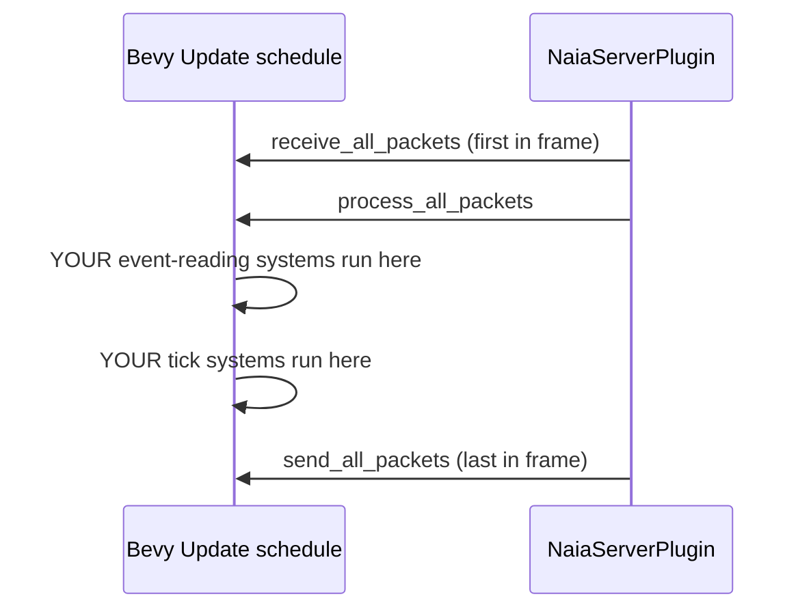

# Your First Server

This chapter builds the server from the [Bevy Quick Start](bevy-quickstart.md)
step by step, explaining each piece. By the end you will understand why the Bevy
plugin works the way it does and how to extend it for a real game.

> **Core API:** Not using Bevy? The bare `naia-server` API is identical in concept
> but uses a direct method-call loop instead of Bevy systems. See
> [Core API Overview](../adapters/overview.md).

---

## Project layout

```
my_game/
  shared/   ← protocol, components, channels  (Cargo.toml: naia-shared)
  server/   ← naia-bevy-server binary
  client/   ← naia-bevy-client binary         (next chapter)
```

## Cargo.toml

```toml
# server/Cargo.toml
[package]
name    = "my-game-server"
version = "0.1.0"
edition = "2021"

[[bin]]
name = "server"
path = "src/main.rs"

[dependencies]
bevy             = { version = "0.13", default-features = false, features = ["bevy_core_pipeline"] }
naia-bevy-server = "0.24"
my-game-shared   = { path = "../shared" }
```

---

## Step 1 — Plugin setup

`NaiaServerPlugin` replaces naia's five-step loop with Bevy-native scheduling.
You provide a `ServerConfig` (timeouts, heartbeat rate) and the shared `Protocol`.

```rust
use bevy::prelude::*;
use naia_bevy_server::{Plugin as NaiaServerPlugin, ServerConfig};
use my_game_shared::protocol;

fn main() {
    App::new()
        .add_plugins(MinimalPlugins)
        .add_plugins(NaiaServerPlugin::new(ServerConfig::default(), protocol()))
        .run();
}
```

> **Note:** `NaiaServerPlugin` inserts `receive_all_packets`, `process_all_packets`,
> and `send_all_packets` as Bevy systems at fixed positions in the schedule. You
> never call those methods manually — the plugin owns the loop.

---

## Step 2 — System ordering

The plugin arranges naia's work around your systems automatically:



Your systems only need to read events and mutate components — ordering relative
to naia's internal systems is handled.

---

## Step 3 — Startup listener

The startup system calls `server.listen(...)` once. The `Server` type is a Bevy
`SystemParam` that gives direct access to naia's server handle.

```rust
use naia_bevy_server::{transport::udp::NativeSocket, Server};

fn startup(mut server: Server) {
    server.listen(NativeSocket::new("0.0.0.0:14191"));
    println!("Server listening on 0.0.0.0:14191");
}
```

Add it to the app:

```rust
.add_systems(Startup, startup)
```

---

## Step 4 — Handling connections

`ConnectEvent` fires once per new client immediately after the handshake
completes. This is the right place to create rooms and spawn player entities.

```rust
use bevy::prelude::*;
use naia_bevy_server::{
    CommandsExt, RoomKey, Server,
    events::{ConnectEvent, DisconnectEvent},
};
use my_game_shared::Position;
use std::collections::HashMap;

#[derive(Resource, Default)]
struct UserEntities(HashMap<u64, Entity>);

#[derive(Resource)]
struct GlobalRoom(Option<RoomKey>);

fn handle_connections(
    mut commands: Commands,
    mut server: Server,
    mut connect_reader: EventReader<ConnectEvent>,
    mut global_room: ResMut<GlobalRoom>,
    mut user_entities: ResMut<UserEntities>,
) {
    let room_key = *global_room.0.get_or_insert_with(|| server.create_room().key());

    for ConnectEvent(user_key) in connect_reader.read() {
        let entity = commands
            .spawn_empty()
            .enable_replication(&mut server)  // ← registers entity with naia
            .insert(Position::new(0.0, 0.0))
            .id();

        server.room_mut(&room_key).add_user(user_key);
        server.room_mut(&room_key).add_entity(&entity);

        user_entities.0.insert(user_key.to_u64(), entity);
        println!("Connected: {:?} → entity {:?}", user_key, entity);
    }
}
```

> **Note:** `enable_replication` is the critical call. Without it naia does not
> know the entity exists and will not send `SpawnEntity` packets to clients. The
> `insert(Position::new(...))` call happens on a naia-tracked entity, so naia
> immediately queues the initial component value for delivery.

### Handling disconnections

```rust
fn handle_disconnections(
    mut commands: Commands,
    mut disconnect_reader: EventReader<DisconnectEvent>,
    mut user_entities: ResMut<UserEntities>,
) {
    for DisconnectEvent(user_key) in disconnect_reader.read() {
        if let Some(entity) = user_entities.0.remove(&user_key.to_u64()) {
            commands.entity(entity).despawn();
            // naia automatically sends DespawnEntity to all in-scope clients.
        }
    }
}
```

---

## Step 5 — The tick event

`ServerTickEvent` fires once for each elapsed server tick (configured in the
`Protocol` as `tick_interval`). Mutation of replicated components belongs here.

```rust
use naia_bevy_server::events::ServerTickEvent;
use my_game_shared::{InputChannel, PlayerInput, Position};

fn handle_tick(
    mut server: Server,
    mut tick_reader: EventReader<ServerTickEvent>,
    mut positions: Query<&mut Position>,
) {
    for ServerTickEvent(server_tick) in tick_reader.read() {
        // Deliver TickBuffered input from clients at this exact tick.
        let mut messages = server.receive_tick_buffer_messages(server_tick);
        for (user_key, input) in messages.read::<InputChannel, PlayerInput>() {
            // Apply input to the entity owned by this user.
            // (Look up entity in your UserEntities resource here.)
            let _ = (user_key, input);
        }

        // Advance all positions.
        for mut pos in positions.iter_mut() {
            *pos.x += 0.1;
        }
        // naia diffs each mutated Property<f32> field against the last
        // acknowledged snapshot for each in-scope client.
    }
}
```

> **Note:** The plugin calls `send_all_packets` after your tick systems complete.
> You do not need to — and must not — call it yourself.

---

## Putting it together

```rust
// server/src/main.rs (complete)
use std::collections::HashMap;

use bevy::prelude::*;
use naia_bevy_server::{
    transport::udp::NativeSocket,
    CommandsExt, Plugin as NaiaServerPlugin, RoomKey, Server, ServerConfig,
    events::{ConnectEvent, DisconnectEvent, ServerTickEvent},
};
use my_game_shared::{protocol, InputChannel, PlayerInput, Position};

fn main() {
    App::new()
        .add_plugins(MinimalPlugins)
        .add_plugins(NaiaServerPlugin::new(ServerConfig::default(), protocol()))
        .insert_resource(UserEntities::default())
        .insert_resource(GlobalRoom(None))
        .add_systems(Startup, startup)
        .add_systems(Update, (handle_connections, handle_disconnections, handle_tick))
        .run();
}

#[derive(Resource, Default)]
struct UserEntities(HashMap<u64, Entity>);
#[derive(Resource)]
struct GlobalRoom(Option<RoomKey>);

fn startup(mut server: Server) {
    server.listen(NativeSocket::new("0.0.0.0:14191"));
}

fn handle_connections(
    mut commands: Commands,
    mut server: Server,
    mut connect_reader: EventReader<ConnectEvent>,
    mut global_room: ResMut<GlobalRoom>,
    mut user_entities: ResMut<UserEntities>,
) {
    let room_key = *global_room.0.get_or_insert_with(|| server.create_room().key());
    for ConnectEvent(user_key) in connect_reader.read() {
        let entity = commands
            .spawn_empty()
            .enable_replication(&mut server)
            .insert(Position::new(0.0, 0.0))
            .id();
        server.room_mut(&room_key).add_user(user_key);
        server.room_mut(&room_key).add_entity(&entity);
        user_entities.0.insert(user_key.to_u64(), entity);
    }
}

fn handle_disconnections(
    mut commands: Commands,
    mut disconnect_reader: EventReader<DisconnectEvent>,
    mut user_entities: ResMut<UserEntities>,
) {
    for DisconnectEvent(user_key) in disconnect_reader.read() {
        if let Some(entity) = user_entities.0.remove(&user_key.to_u64()) {
            commands.entity(entity).despawn();
        }
    }
}

fn handle_tick(
    mut server: Server,
    mut tick_reader: EventReader<ServerTickEvent>,
    mut positions: Query<&mut Position>,
) {
    for ServerTickEvent(server_tick) in tick_reader.read() {
        let mut messages = server.receive_tick_buffer_messages(server_tick);
        for (_user_key, _input) in messages.read::<InputChannel, PlayerInput>() {}
        for mut pos in positions.iter_mut() {
            *pos.x += 0.1;
        }
    }
}
```

---

## What happens per frame

1. Plugin: `receive_all_packets` reads UDP datagrams.
2. Plugin: `process_all_packets` decodes packets into Bevy events.
3. Your systems: `handle_connections` and `handle_disconnections` drain connection events.
4. Your systems: `handle_tick` advances simulation.
5. Plugin: `send_all_packets` serializes field diffs and flushes to the network.

On a client connecting for the first time, step 5 delivers:
- A `SpawnEntity` packet for each entity in the user's scope.
- A full component snapshot (all `Position` field values) for each such entity.

On subsequent frames, only changed fields travel over the wire.

---

## Next steps

- [Your First Client](first-client.md) — receive those events on the client side.
- [Running the Demos](demos.md) — run the complete `demos/bevy/` example.
- [Rooms & Scoping](../concepts/rooms.md) — fine-grained per-entity visibility.
- [Messages & Channels](../concepts/messages.md) — typed message passing.
- [Tick Synchronization](../concepts/ticks.md) — tick rate, `TickBuffered` input, and client-side prediction.
