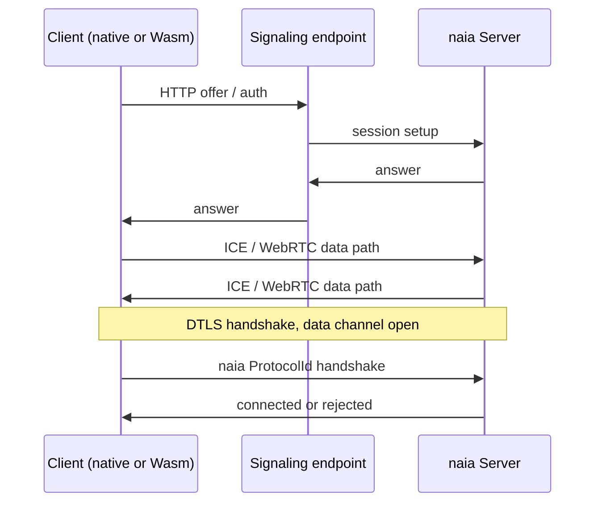

# WebRTC (Native + Browser)

`transport_webrtc` is naia's preferred transport for most projects. It supports
a native server, native clients, and `wasm32-unknown-unknown` browser clients
from the same server, with DTLS provided by WebRTC.

Enable it on the crate you use:

```toml
naia-bevy-server = { version = "0.25", features = ["transport_webrtc"] }
naia-bevy-client = { version = "0.25", features = ["transport_webrtc"] }
```

or, without Bevy:

```toml
naia-server = { version = "0.25", features = ["transport_webrtc"] }
naia-client = { version = "0.25", features = ["transport_webrtc"] }
```

---

## Connection Flow



---

## Server Setup

```rust
use naia_bevy_server::{transport::webrtc, Server};

fn startup(mut server: Server) {
    let addrs = webrtc::ServerAddrs::new(
        "0.0.0.0:14191".parse().unwrap(), // signaling/auth HTTP
        "0.0.0.0:14192".parse().unwrap(), // WebRTC data UDP
        "https://game.example.com:14192", // public data URL clients can reach
    );

    let socket = webrtc::Socket::new(&addrs, server.socket_config());
    server.listen(socket);
}
```

For local development, `webrtc::ServerAddrs::default()` uses localhost ports.

---

## Client Setup

```rust
use naia_bevy_client::{transport::webrtc, Client};

fn startup(mut client: Client) {
    let socket = webrtc::Socket::new(
        "https://game.example.com:14191",
        client.socket_config(),
    );
    client.connect(socket);
}
```

The same code shape works for native and Wasm clients. Browser builds still need
the normal Rust Wasm target and a web bundler such as Trunk or wasm-pack.

---

## Deployment Notes

- The signaling endpoint is HTTP(S). Put it behind TLS in production.
- The WebRTC data address must be reachable by clients. NAT/firewall rules still
  matter; WebRTC is not magic, just very well-dressed networking.
- Native and browser clients can connect to the same server at the same time.
- Use the exact same `Protocol` on every target. Transport selection should not
  change your registered components, messages, channels, or resources.
