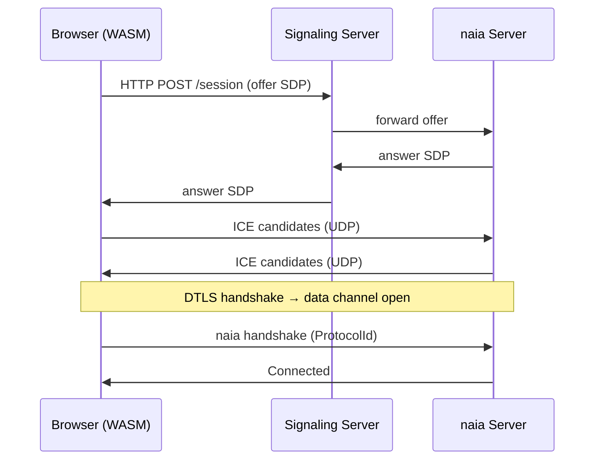

# WebRTC (Browser Clients)

naia's `transport_webrtc` enables browser clients built with
`wasm32-unknown-unknown` to connect to a native naia server over WebRTC data
channels. WebRTC provides DTLS encryption automatically.

---

## Connection flow



---

## Server setup

The naia WebRTC server handles the signaling endpoint internally. You provide
the signaling port (HTTP) and the WebRTC data port (UDP):

```rust
server.listen(WebrtcSocket::new(
    "0.0.0.0:14192", // signaling port (HTTP)
    14193,           // WebRTC data port (UDP, must be publicly reachable)
));
```

---

## Browser client setup

In your WASM client, enable the `wbindgen` feature on the socket crate and
connect with:

```rust
client.connect(WebrtcSocket::new(
    "https://myserver.example.com", // signaling URL
    14192,                          // signaling port
));
```

Build with `wasm-pack build` or `trunk build --release`. All naia protocol,
channel, and game logic is identical to the native client — only the entry
point and socket type change.

---

## CORS

The signaling endpoint is an HTTP server embedded in naia. Ensure your server's
CORS policy allows requests from the domain serving your WASM file if they
differ.

---

## iOS / Android via WebView

The WASM client build runs inside WKWebView (iOS) or Android WebView using the
same `transport_webrtc` path as the browser target. Frameworks such as
Capacitor automate the WebView wrapper.

> **Note:** Native iOS/Android socket support is not yet implemented — blocked on
> `transport_quic` providing a production-ready encrypted mobile transport. The
> WebView path is the recommended workaround today.
